% Pangalaxian Reference
% Stephen Waterbury / Code 585
% v. 1.8

# Overview:  Pangalaxian Architecture

**Pangalaxian** is a Collaborative Model-Based Engineering (MBE) framework,
consisting of a **Desktop Client**, a network **Message Bus**, and a repository
service network interface that provides access to a **Systems Database** and
**Systems and Components Library**, as shown in the diagram below.  **Pangalaxian**
uses the **OMB** (**Omnipotent Management Backend**) administrative service to
manage projects, users, roles, and role assignments (which determine
authorizations).

This user guide is primarily focused on how to use the **Pangalaxian Desktop
Client**, including some reference documentation regarding the structure of
the **engineering and scientific data objects (see [Glossary](#glossary))**
that **Pangalaxian** creates (or imports) and manages.

# A Word About Nomenclature ...

In the manufacturing domain, there are many terms for the concept of *designed
artifact*, e.g. **System**, **Subsystem**, **Component**, **Part**.  The
general term most widely used in engineering data standards is
**["Product"](#product-a.k.a.-system-subsystem-component-part)** -- hence,
**Pangalaxian** uses the term **Product** for all of those items.  The use of the
more general term **Product** is simply a convention and in no way limits the
types of information and models that can be associated with an artifact,
independently of whether it is referred to in some contexts as a **System** (a
complex **Product** with internal structure and behaviors) and in others a
**Component** (a **Product** used in the assembly of another **Product**).

**Pangalaxian** generally uses the term **System** in the context of a ***white
box*** model of a **Product** (i.e., one in which the internal structures
and/or interfaces of the **Product** are known) and **Component** in the
context of a ***black box*** model (in which only the attributes and external
shape and/or interfaces are known or relevant).  **Pangalaxian** is designed to
support the multi-disciplinary nature of **Product** models, so for any given
**Product**, **Pangalaxian** can maintain and track its relationships to multiple
***white box*** and ***black box*** models.  Indeed, it is perfectly normal for
a **Product** to have several types of models, some of which are ***white
boxes*** and some ***black boxes***, developed and used by discipline engineers
in various design and analysis contexts.

# Main Window Elements

The **Pangalaxian** **Main Window** consists of a **Tool Bar**, a central area with
various widgets (such as a **Dashboard** and a **System Tree**), and a **Status
Bar** at the bottom, which displays messages regarding network interactions and
local database events.  Many of the labels and buttons shown have "tooltips"
(brief help messages that display when the mouse hovers over them).  The figure
below shows the elements of the user interface when it is in **Systems
Modeler** **mode** (user interface **modes** are explained in detail in the
[User Interface Modes](#user-interface-modes) section, below).

## Menu: Input

The **Input** menu provides functions to import data or objects.

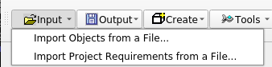

#### An Important Note about Importing Data from Exported Data Files

Note that although **Pangalaxian** can import data from a file that has been
created using the export functions, importing data that contains objects that
were created by other users should not be done by a non-administrative user
because of data synchronization issues with the repository:  when the user logs
in after importing data, the repository sync process will delete any objects
not created by the local user unless they already exist in the repository.
That is because the repository only allows users to save objects that they
create or are authorized to modify, so when **Pangalaxian** sends data to the
repository for synchronization and the data contains an object that was created
by another user but the object is not present in the repository, the repository
assumes that the object was deleted either by its creator or by an authorized
user, so the repository will instruct **Pangalaxian** to delete the object locally.

For the above reasons, if a user wants to recreate all or part of a saved
database or project that contains objects created by other users, the best way
to do that is to send the exported file to the repository administrator and ask
them to load it; then if the user is assigned a role in the project(s) or
organization(s) that own(s) the data, their **Pangalaxian** client will receive
that data in the sync process the next time the user connects to the
repository.

### Import Objects from a File...

Enables the user to import a **[Project](#project)** (including all its systems
and their assemblies) from a file that was created using the
**[Export Project to a File](#export-project-to-a-file...)** function.

Clicking this menu item opens a file dialog so the user can select the file to
be imported -- when the file is selected, the import process begins.  Progress
is shown by messages in the status bar.

### Import Project Requirements from a File...

Enables the user to import all **[Requirements](#requirement)** from a
file that was created using the
**[Export Project Requirements to a File](#export-project-requirements-to-a-file...)**
function.

Clicking this menu item opens a file dialog so the user can select the file to
be imported -- when the file is selected, the import process begins.  Progress
is shown by messages in the status bar.

## Menu: Output

The **Output** menu provides functions to export data or objects.

### Export Project to a File...

Enables the user to export the currently selected **[Project](#project)**
(including all its systems and their assemblies) to a file, which can be saved
as a backup.  The exported file can later be imported into **Pangalaxian** using
the [Import Project from a File](#import-project-from-a-file...) function --
however, see the
*[important note about importing data](#an-important-note-about-importing-data-from-exported-data-files)*.

The format of the exported file self-describing and it therefore has some
degree of schema-independence.  **Pangalaxian** releases will sometimes involve
internal database schema changes, and since the exported file is
schema-independent, the
[Import Project from a File](#import-project-from-a-file...)
function can migrate the imported data to the new schema -- however, see the
*[important note about importing data](#an-important-note-about-importing-data-from-exported-data-files)*.

### Export Project Requirements to a File...

Enables the user to export the set of **[Requirements](#requirement)**
applicable to the currently selected **[Project](#project)** to a file, which
can be saved as a backup.  The exported file can later be imported into
**Pangalaxian** using the
[Import Project Requirements from a File](#import-project-requirements-from-a-file...)
function -- however, see the
*[important note about importing data](#an-important-note-about-importing-data-from-exported-data-files)*.

### Write MEL...

Generates a [Master Equipment List (MEL)](#master-equipment-list-mel) derived
from the systems, sub-systems, and components as they are assembled for the
currently selected **[Project](#project)**.

Clicking this menu item displays a file dialog so the user can select an
appropriate name and location for the file that is created.

### Dump Local Database to a File...

Writes the complete local database to a file as a set of serialized objects,
which are serialized in the **Pangalaxian** standard serialization format and
encoded into [YAML]("https://en.wikipedia.org/wiki/YAML").  Clicking this menu
item displays a file dialog so the user can select an appropriate name and
location for the file that is created.

### Generate a Public/Private Key Pair...

Generates a pair of encrypted keys for use in the **Pangalaxian** server login
process.  The **public key** (*public.key*) will be written into the
*pangalaxian_home* directory, which is located in the user's home directory.  The
**private key** (*private.key*) is written into the *.creds* subdirectory of
*pangalaxian_home*, and it should not be moved.  The user should email the
*public.key* file to the **Pangalaxian** administrator when requesting a user
account.  After that, the *public.key* file is no longer needed by **Pangalaxian**.
When the *Network Login* icon in the **Tool Bar** is clicked, the **Pangalaxian**
client will use the *private.key* file to do a transparent single-sign-on login
to the **Pangalaxian** server.

## Menu: Create New Objects

The **Create New Objects** menu provides functions to create new
[Products (a.k.a. Systems, Components)](#product-a.k.a.-system-subsystem-component-part),
[Functional Requirements](#requirement), [Performance Requirements](#requirement), and
[Tests](#test).

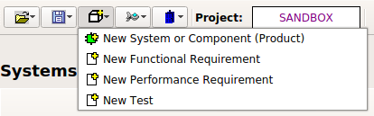

### New System or Component (Product)

Displays the [System / Component Wizard](#system-component-wizard) (follow link
to that section for details.)

")

### New Functional Requirement

Displays a wizard (see figure below) in which the user can create a new
**[Functional Requirement](#functional-requirement)**.

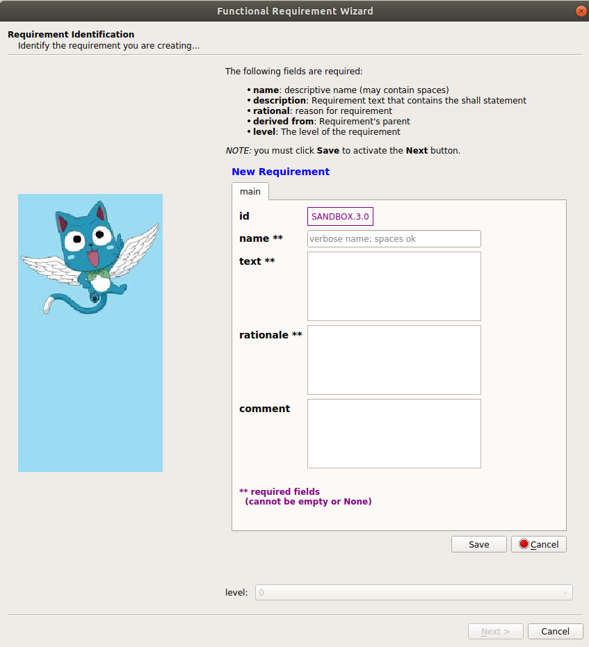

### New Performance Requirement

Displays a wizard (see figure below) in which the user can create a new
**[Performance Requirement](#performance-requirement)**.

A **[Requirement](#requirement)** is typically owned (defined and managed) by
an **Organization**, and when a new **Requirement** is defined, **Pangalaxian**
assigns the currently selected **Project** as its ***owner*** (the ***owner***
field is on the **info** tab of the **[Object Editor](#object-viewer-editor)**)
-- note that that is just a default assignment of ***owner***, and can be
modified by the ***creator*** of the **Requirement** (i.e. the user who is
editing it).  The ***id*** attribute also gets a default prefix from the
**Project** ***id*** -- for example, the figure shows the ***id*** prefix as
"**SANDBOX**", since it was created while the *SANDBOX* **Project** was
selected.

It is also worth noting that, as explained in the
**[Project Requirements Manager](#project-requirements-manager)** section
below, the **Project Requirements Manager** function will display all
**Requirements** for which the ***owner*** is the currently selected
**Project**.

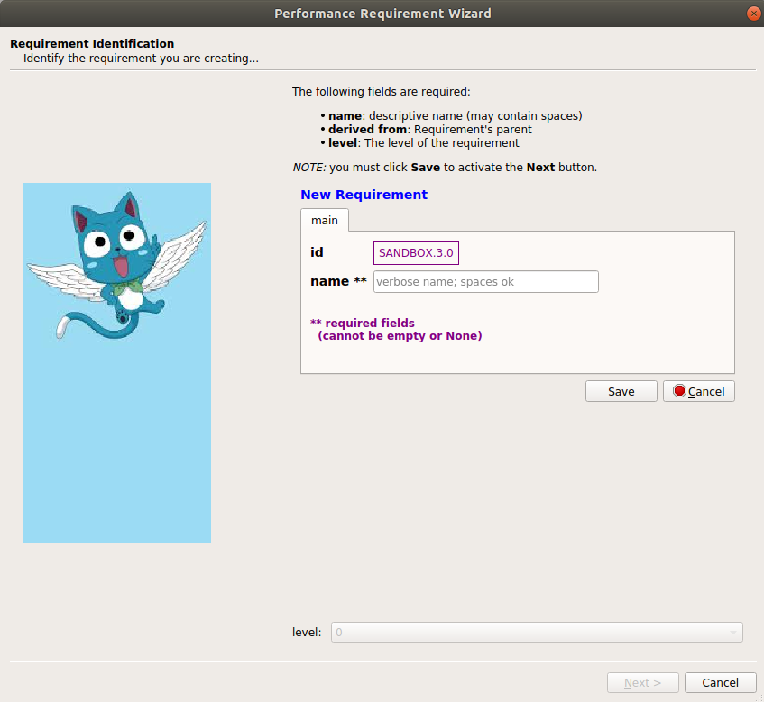

### New Test

Displays a dialog (see figure below) in which the user can create a new
**[Test](#test)**.  All fields shown in the figure are required.  The
***verifies*** field is used to reference the **[Requirement](#requirement)** that
the **[Test](#test)** is intended to verify.

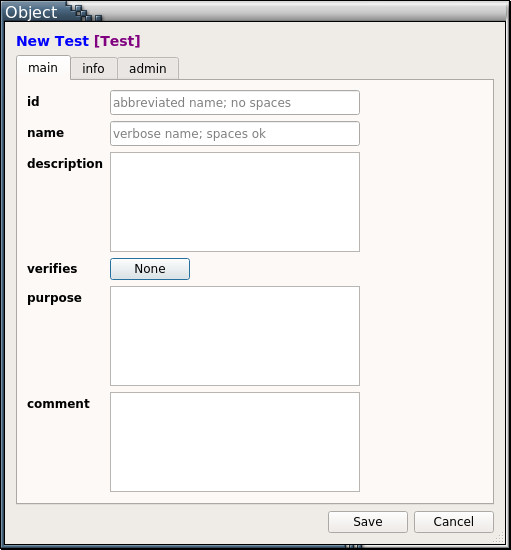

## Menu: Tools

The **Tools** menu provides functions for various tasks such as editing the
user's preferences, displaying libraries in separate windows, and some
administrative tasks such as updating **Pangalaxian**.

### Project Requirements Manager

Displays all **[Requirements](#requirement)** for the currently selected
**[Project](#project)** in a dialog window.  The user can filter the displayed
items by typing a string into the **Filter** field -- filtering will be
case-sensitive if the **case sensitive** box is checked, otherwise it will be
case-insensitive (the default).

As shown in the screen capture below, selecting a requirement on the left side
(by left-clicking on it) will highlight in yellow the system/subsystem in the
assembly tree on the right side to which the requirement has been allocated
(assuming it has been allocated).  The screen capture also shows the context
menu that is displayed by right-clicking on a requirement, if you have edit
privileges for the requirement based on your assigned role(s) in the project.
If you do have such privileges, you can either edit just the performance
parameter associated with the requirement (second screen shot below), or import
the requirement into the **[Requirement Wizard](#new-performance-requirement)**
to edit other properties of the requirement.

### ConOps Modeler

The **ConOps Modeler** tool provides a drag and drop interface for the creation
of mission timelines.

### Systems and Components (Hardware Products) Library

The **Systems and Components (Hardware Products) Library** menu item brings up
the library in a dialog window. The same **Systems and Components (Hardware
Products) Library** is also displayed in the **"Libraries"** panel on the right
side of the **Main Window** (see **[Main Window
Elements](#main-window-elements)**).  Some reasons why you might want to
display the library in a separate dialog window include:  

  1. you need a wider view, including more fields (columns) than are shown in the **Libraries** panel on the right side;  

  2. you need to view one of the other libraries at the same time, such as the **[Parameter Definitions Library]**, the **[System and Component Templates Library]**, or the **[Port Templates Library]**.

Note that the user can click and drag any item in the library and add it as a
component to another system by dropping it onto either the system's node in the
**System Assembly Tree** or its block in the **Block Model**.  See the
**[System Assembly via Drag and Drop](#system-assembly-via-drag-and-drop)**
section for details on how the *drag-and-drop* assembly process works.

#### Sorting and Filtering

The user can *sort* the **Systems and Components (Hardware Products) Library**
on any column by clicking on the column heading.  The user can *filter* the
displayed items by typing a string into the **Text Filter** field -- filtering
will be case-sensitive if the **case sensitive** box is checked; otherwise it
will be case-insensitive (the default).  The user can view details about any
item in the library by right-clicking on the item (which displays a context
menu) and then selecting **"View this object"**, which will display the item in
the **[Object Viewer/Editor](#object-viewer-editor)**.

 Library Dialog")

### System and Component Templates Library

Displays all **[System and Component Templates](#template)** in a dialog window.

In **[Component Modeler](#component-modeler)** mode, you can use
*drag-and-drop* to create a new system from a **Template**:  simply *drag* the
**Template** from the **System and Component Templates Library** and *drop* it
onto the **Product Info Panel** -- this will create the new system, put its
information into the **Product Info Panel** and the **Object Viewer/Editor**,
and create a block for it on the **Diagram Canvas**.  Since you are the creator
of the new system, you can edit it in the **Object Viewer/Editor** and give it
components by *drag/dropping* them onto its block in the **Diagram Canvas**.

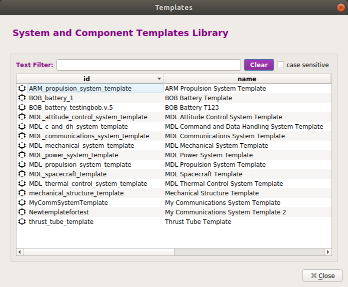

### Product Types Library

Displays all **[Product Types](#product-type)** in a dialog window.  This
library is used in assigning a value to the **product_type** attribute of any
component or system.  It is only made accessible here as a dialog for
information, in case you want to see the definition for any **Product Type**.

### Port Types Library

Displays all **Port Types** in a dialog window.

In **[Component Modeler](#component-modeler)** mode, you can use
*drag-and-drop* to add a **Port** to a system or component: simply *drag* the
**Port Type** from the **Port Types Library**, *drop* it onto the
system or component's block in the **Diagram Canvas**, and the new **Port**
will be created.

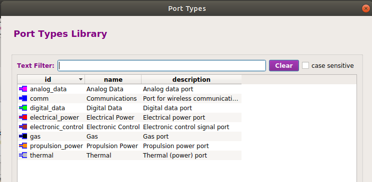

### Port Templates Library

Displays all **Port Templates** in a dialog window.

In **[Component Modeler](#component-modeler)** mode, you can use
*drag-and-drop* to add a **Port** to a system or component: simply *drag* the
**Port Template** from the **Port Templates Library**, *drop* it onto the
system or component's block in the **Diagram Canvas**, and the new **Port**
will be created.

The advantage of using a **Port Template** instead of a **Port Type** is that a
**Port Template** has a parametric value assigned (e.g. a 28 Volt power port
will have a Voltage parameter value of 28 assigned), whereas a **Port Type**
has no specific parameter values, but rather it is intended to have parameters
and values assigned after it is created.  So a **Port Template** is more useful
when a "standard" port with a characteristic parameter value is needed and a
template with that value exists in the library.

### Parameter Definitions Library

Displays the **[Parameter Definitions](#parameter-definition) Library** in a
dialog window.  The **Parameter Definitions Library** can also be displayed in
the **"Libraries"** panel on the right side of the **Main Window** (see
**[Main Window Elements](#main-window-elements)**).  Reasons to want the
**Parameter Definitions Library** displayed in a separate window include:

  1. you need a wider view, including more fields (columns) than are shown in the **Libraries** panel on the right side;  

  2. you need to view one of the other libraries
(**[Systems and Components (Hardware Products) Library]** or
**[System and Component Templates Library]**) simultaneously with the
**Parameter Definitions Library**.

The user can *sort* the **Parameter Definitions Library** on any column by
clicking on the column heading.  The user can *filter* the displayed items by
typing a string into the **Filter** field -- filtering will be case-sensitive
if the **case sensitive** box is checked; otherwise it will be
case-insensitive (the default).  The user can view details about any item in
the library by right-clicking on the item (which displays a context menu) and
then selecting **"View this object"**, which will display the item in the
**[Object Viewer/Editor](#object-viewer-editor)**.

The **Parameter Definitions Library** supports *drag-and-drop*: the user can
click and drag any item in the library and drop it onto the **parameters
panel** in the **[Object Viewer/Editor](#object-viewer-editor)** to assign a
**Parameter** to an object.  See the
**[Object Viewer/Editor](#object-viewer-editor)** section for details on how
the *drag-and-drop* process for adding a **Parameter** works.

### Data Element Definitions Library

Displays the **[Data Element Definitions](#parameter-definition) Library** in a
dialog window.  The **Data Element Definitions Library** can also be displayed in
the **"Libraries"** panel on the right side of the **Main Window** (see
**[Main Window Elements](#main-window-elements)**).  Reasons to want the
**Data Element Definitions Library** displayed in a separate window include:

  1. you need a wider view, including more fields (columns) than are shown in the **Libraries** panel on the right side;  

  2. you need to view one of the other libraries
(**[Systems and Components (Hardware Products) Library]** or
**[System and Component Templates Library]**) simultaneously with the
**Data Element Definitions Library**.

The user can *sort* the **Data Element Definitions Library** on any column by
clicking on the column heading.  The user can *filter* the displayed items by
typing a string into the **Filter** field -- filtering will be case-sensitive
if the **case sensitive** box is checked; otherwise it will be
case-insensitive (the default).  The user can view details about any item in
the library by right-clicking on the item (which displays a context menu) and
then selecting **"View this object"**, which will display the item in the
**[Object Viewer/Editor](#object-viewer-editor)**.

### Refresh System Tree and Dashboard

In **[Systems Modeler](#systems-modeler)** mode, re-generates the assembly tree
and dashboard from the local database.  (Should only be needed in the rare case
of an incomplete synchronization operation.)

### Re-Sync Current Project

### Force Full Re-Sync

### View a CAD Model... (Windows and Linux only)

Displays a file dialog in which the user can select a **[STEP](#step)** file
(also known as a **"part 21 file"**), which should have a suffix of *.p21*,
*.stp*, or *.step*. When a file is selected, the **CAD Viewer** attempts to
read it and, if successful, renders and displays the model.  The **CAD Viewer**
is a **3D Viewer** with *rotate*, *zoom*, and *translate* functionality.  The
viewer can render models that follow either of the **[STEP](#step)** protocols
for *Mechanical CAD*: ***AP203*** or ***AP214***.  The **OK** and **Cancel**
buttons both do the same thing:  close the viewer.

* ***rotate***: use the left mouse button to rotate the model
* ***zoom***: use the mouse wheel **or** hold down the right mouse button and drag *diagonally* on the viewer canvas to zoom in and out
* ***translate***: hold down the middle mouse button and drag to move the model translationally
* ***change rendering***: with focus on the viewer,
    - **shift-W** for **wireframe**
    - **shift-S** for **solid with shading**

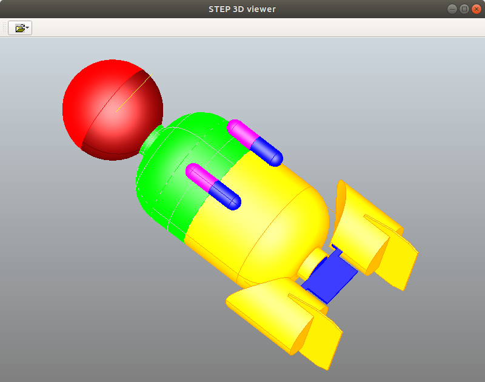

")

### View CAD Model(s)... (OSX and Linux only)

### Edit Preferences

Displays a dialog in which the user can edit some settings for customization.
Any values set in the **Preferences** dialog take effect when the dialog is
accepted (i.e., the **OK** button is clicked), and they are saved between
sessions.

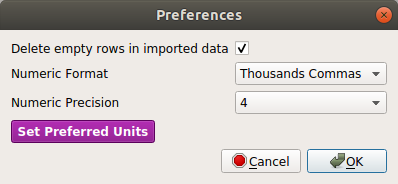

**Options**:

* **Delete empty rows in imported data**  
  (what it says)

* **Numeric Format**  
  Specifies the format options for numeric **Parameter** values:

    - Thousands Commas (default)
    - No Commas
    - Scientific Notation

* **Numeric Precision**  
  Specifies the number of digits to be regarded as *significant* in
  **Parameter** values.  Options are any integer value from 3 to 9, with 3
  being the default.

* **Preferred Units**
  Specifies for each available dimensionality, which units will be used in
  displaying the **Parameter** values that have those dimensions.  When the
  unit preferences have been changed and both the **Preferred Units** *and* the
  **Edit Preferences** dialogs have been accepted (**OK** has been clicked on
  both), any dashboard parameter values that have the relevant units will
  immediately be converted and displayed in the new preferred units.

## Help

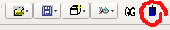

Clicking the *Help button* (a tiny *[TARDIS](#tardis)*) displays the
**Pangalaxian** release version.

## Project Selector

Clicking the **Project Selector** button displays a list of the currently known
**[Projects](#project)** to which the user has access.

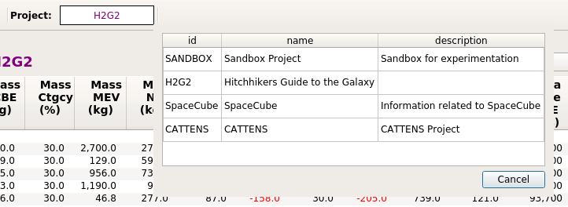

Right-clicking the **Project Selector** button displays a context menu (shown
below).  The first option in the menu will be **New Project**, which if
selected will display the **New Project Dialog**, in which the user can create
a new **Local Project**.  If the user is the ***creator*** of the currently
selected **Project** and it is a **Local Project**, the second menu option will
be **Delete Project**.  Note that if the user deletes a **Project**, the items
created within that project will continue to exist -- only the **Project**
itself is deleted.

## Network Login / Logout

When the mouse hovers over the **Network Login/Logout** button, a "tooltip" is
displayed, as shown below, **Connect to the message bus**:

The **Pangalaxian** client is not connected to the network until the user logs in,
which is done by clicking the **Network Login** button, which displays a login
dialog:

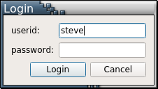

The **Network Login/Logout** button is a toggle, so clicking on it while
connected will disconnect **Pangalaxian** from the **Message Bus**.  The
*connected* / *disconnected* status is shown by the *network status indicator*
in the lower right corner of the main window:

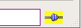  

Once the user logs in to the **Message Bus**, the **Pangalaxian** client begins a
programmed set of network interactions that synchronize its local database with
the **Pangalaxian** repository.  The initial interactions upon connection include:

1.  Get the set of **Projects** on which the user has been assigned **Roles**.
    (This may result in **Projects** being added or removed in the **Project
    Selector**.)
2.  Subscribe to the channels on which those **Projects** publish events, such
    as the addition of new **Systems** and **Components** to the **Project**.
3.  Synchronize the **Parameter Definitions** in the local database with those
    in the repository (this will include both getting from the repository any
    new **Parameter Definitions** and saving to the repository any new
    **Parameter Definitions** created by the user).
4.  Local user-created objects are saved to the repository (or deleted, if they
    were deleted locally since the last login and are not being used in a
    **Project**).
5.  Any new (since last login) objects in the repository **Hardware Library**
    are fetched and added to the local database.
6.  The currently selected **Project** is synced:  the current state of its
    assembly tree is replicated locally and any objects that have been added to
    the **Project** (such as **Project Requirements**) since the last login are
    fetched and added to the local database.
7.  The user's assigned **Role(s)** in the current **Project** will be
    displayed in the **Status Bar** (in the status label next to the *network
    status indicator*) if the current project is a collaborative project -- if
    it is a local project, the status label will say "**[local]**".

Once the initial sync is completed, the **Pangalaxian** client will listen for
events on the message bus, such as additions or modifications of objects, and
will update itself accordingly in real-time.

Whenever the user switches to a different project using the **Project
Selector**, the sync operation (step 6 above) is executed for the newly
selected **Project**.

# User Interface Modes

The **Pangalaxian** GUI has four interface **modes** of operation:

* **[Component Modeler]**
* **[Systems Modeler]**
* **[Local DB]**
* **[Data Mode]**

A **mode** is entered by clicking on one of the four **Mode Buttons** in the
top right corner of the user interface, as shown in the figure below.  Just to
the left of the **Mode Buttons** is the **Mode Indicator**, which shows the
currently selected **mode**.  The buttons are shown here with **[Systems
Modeler](#systems-modeler)** **mode** selected.  When you exit **Pangalaxian**, it
will remember the **mode** you are in and will return you to that **mode** the
next time it starts up.

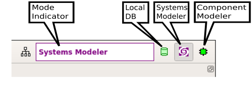

## Component Modeler

**Component Modeler** mode is intended to provide convenience for the user when
viewing and/or editing **Components**, **Systems**, or library **Products**.

When in **Component Modeler** mode, the user can select any **Product** from
the **Hardware Library**, **drag and drop** it (see
figure below) from the library onto the **Product Info Panel** (the upper panel
in the Main Window), as shown below, and that **Product** will become the
"subject" of the **Component Modeler**: its ***id***, ***name***, and
***version*** will be displayed in the **Product Info Panel**, its full set of
**Parameter** values and metadata will be shown in the **Object Viewer/Editor
Panel** in the left panel, and its **Block Model** will be shown in the central
**Diagram Canvas**. (In the current version of **Pangalaxian**, the **Diagram
Canvas** is not editable; in a future version it will be editable.)

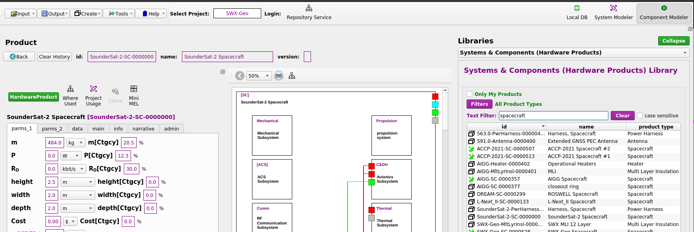

Once a product has been brought into the **Component Modeler**, it can be
viewed and/or edited (if the user has edit permission) in the **Object
Viewer/Editor** panel -- see
**[Object Viewer/Editor](#object-viewereditor "Object Viewer/Editor")** for
more detail.

## Systems Modeler

**Systems Modeler** mode is intended to provide convenience for the user when
viewing and/or editing **Systems**, and in particular when constructing an
assembly structure for a system. In **Systems Modeler** mode, the main window
looks like the figure below:

#### System Assembly via Drag and Drop

The **System Tree** (bottom left panel) is an editable widget that supports
*drag and drop*.  The **Systems Dashboard** (top panel) is automatically synced
with the **System Tree** and displays an expandable table of system parameters
that is computed and updated in real-time, even in collaborative operations --
i.e. when several **Pangalaxian** clients are connected via the **message bus** and
are collaboratively building a system assembly.

To add a component to a node in the **System Tree**, the user can **drag** an item from the
**[Systems and Components (Hardware Products) Library](#systems-and-components-hardware-products-library)**
(right panel) and **drop** it onto the node -- being
careful to drop the item only when the target node is highlighted, as shown
below:

When the mouse button is released, the item (in this case an **Illudium Q-36
Explosive Space Modulator**) will be added as a component (a.k.a. "subsystem")
of the node on which it was dropped (in this case, the **Heart of Gold
Spacecraft**), as shown in the figure below:

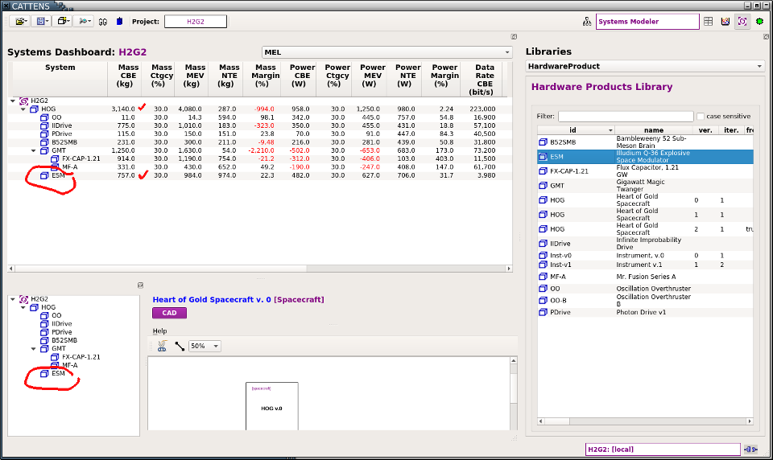

Note that the **Systems Dashboard** has automatically updated with the new
subsystem and the cumulative parameters have been recomputed.  In the example
shown, **Numeric Precision** (see [Edit Preferences](#edit-preferences)) has
been set to **3**, so the total is rounded to 3 significant digits.

Nodes in the **System Tree** can be right-clicked to display a *context menu*:

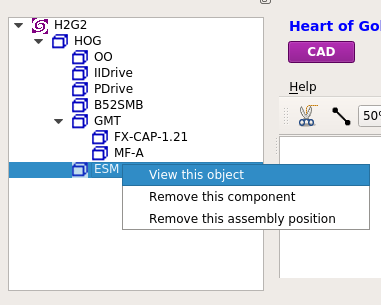

* **View this object** displays the item in the
  **[Object Viewer/Editor](#object-viewereditor)**

* **Remove this component** removes the item from its position in the **System
  Tree** but leaves that position as an "empty bucket" in the assembly that is
  labelled with "**TBD [[Product Type]]**", where **[Product Type]** is the
  **[Product Type]** of the item that was removed, as shown below:

The green "bucket" indicates that there is a role for a product of that type in
the system.  Now an item can be *dragged and dropped* from the **[Hardware
Products Library]** into the empty bucket, but its **[Product Type]** must
match the one specified for that position.  If the item dropped has the correct
**[Product Type]** it will simply "fill" the bucket (i.e., assume that position
in the assembly).

The third option in the *context menu*:

* **Remove this assembly position**, as its name implies, removes not just the
  item from the assembly but also its assembly position.  This option can also
  be used to remove an "empty bucket" (see above) from an assembly.

## Local DB

**Local DB** mode provides a view into the local database.  The database table
names (**DB Tables**) are listed on the left side; clicking on a db table name
displays its objects (**Objects**) in the tablular widget on the right.

Any row in the **Objects** table can be double-clicked to display it in an
**[Object Viewer/Editor]**.  The **Objects** table can be sorted on any column
by clicking on that column's heading.  Columns can be rearranged by drag/drop
(but the new ordering will not be retained).

## Data Mode

**Data Mode** activates the **MEL Tool**.  [Documentation in progress ...]

# Object Viewer/Editor

The **Object Viewer/Editor** provides an interface to all properties and
parameters of an object.  In ***[View Mode]*** (shown here) any user can
inspect any object in **Pangalaxian**.  If the user has edit permission for an
object, an *Edit* button will be displayed (see ***[Edit Mode]*** section,
below).

")

## How To Access

The **Object Viewer/Editor** dialog can be displayed in the following ways:

* In **[Component Modeler]** mode, by right-clicking on any object in the
  **Library Panel** (right side of the
  **[Main Window](#main-window-elements)**) and selecting ***View this
  object*** in the context menu;

* In **[Systems Modeler]** mode, by right-clicking on any object in either the
  **Library Panel** (right side of the **[Main Window](#main-window-elements)**)
  or the **System Tree** (lower left panel) and selecting ***View this
  object*** in the context menu;

* From the
  **[Systems and Components (Hardware Products) Library](#systems-and-components-hardware-products-library)**,
  **[Parameter Definition Library](#parameter-definitions-library)**,
  **[Product Types Library](#product-types-library)**, or
  **[Template Library](#template-library)**, by right-clicking on any object
  and selecting ***View this object*** in the context menu;

* In **[Local DB]** mode, by double-clicking on any object in the **Objects**
  panel (right side).

Note that the **Object Viewer/Editor** has is exactly the same interface and
functionality (and is indeed the same widget) as the **Object Viewer/Editor**
panel in the **[Component Modeler](#component-modeler)** interface:

## Interface Elements

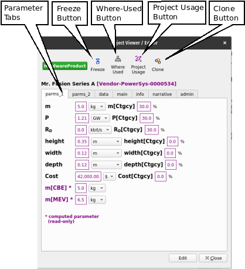

* **Parameter Tabs** display the object's parameters.  As many parameter tabs
  as necessary will be created -- typically, at least 2 parameter tabs are
  needed, to accommodate the minimum default parameters for Mass, Power, Data
  Rate and their associated variants.

* **Clone Button** displays a dialog to begin the process of cloning the object
  -- see **[Cloning](#cloning)**.

* **Models Button** -- *not implemented yet.*  
  (will display a dialog that gives the user options to display
  **[Models](#model)** associated with the object, if there are any, such as
  CAD models, block models, etc.)

* **Other Tabs** include:
    - **main** tab, which contains *id*, *name*, *description*, and other
      fields.
    - **info** tab (optional), which contains fields that "overflow" from
      the **main** tab.
    - **narrative** tab (optional), which contains unlimited text fields.
    - **admin** tab, which contains *oid* (unique object identifier),
      *creator*, *create_datetime*, *modifier*, and *mod_datetime* of the
      object.

## View Mode

The **Object Viewer/Editor** usually initializes in **View Mode** (the
exceptions being in the **[Cloning](#cloning)** process and the **[Component
Wizard]**, in which the process requires **[Edit Mode]**).  If the user has
edit permission for the object being viewed, there will be an **Edit** button
at the bottom of the **Object Viewer/Editor** interface that will switch the
interface to **Edit Mode**.

In **View Mode**, the user can explore the object by selecting various tabs in
the interface.  If an attribute of the object is another object, that
attribute's value will appeaar as a button, which if pushed will display the
related object in another **Object Viewer/Editor**.  In the example below, the
**Oscillation Overthruster B** object has the *create* attribute *"whorfin"*,
which has been clicked to display the *Person* object **John Whorfin**, whose
*org* attribute *yoyodyne* points to the *Organization* object **Yoyodyne
Propulsion Systems**:

## Edit Mode

## Cloning

# System / Component Wizard

The **System / Component Wizard** provides a guided process to create a new [System or
Component (a.k.a. Product)](#product-a.k.a.-system-subsystem-component-part).

Note that any new system or component that is marked **public** will
automatically be added to the **[Systems and Components (Hardware Products) Library]** and will then be
usable in the assembly of any new system.  **Non-public** (sensitive or
proprietary) systems or components (i.e. those for which the **public** field
is not checked) will only be visible to users who have been assigned roles in
their **owner** project or organization.

")

")

")

")

# Libraries

* **[Systems and Components (Hardware Products) Library]**

* **[System and Component Templates Library]**

* **[Product Types Library]**

* **[Port Types Library]**

* **[Port Templates Library]**

* **[Parameter Definitions Library]**

* **[Data Element Definitions Library]**

# Tasks: How do I ...

### Create a new System or Component?
Pangalaxian has 2 ways to do that:

1. **Use the System / Component Wizard** ...  
   In the **Create** menu, select the option
   **[New System or Component (Product)](#new-system-or-component-product)**  
  ***-- or --***
2. **[Clone](#cloning)** an existing system or component.

# Glossary

### Functional Requirement

A **Functional Requirement** is a **[Requirement](#requirement)** that specifies a feature or
behavior that must be implemented by a system.

### Master Equipment List (MEL)

A **MEL** is a specialized bill of materials report, which takes the form of an
*Excel* file in the standard format specified in **"GSFC's MEL Guidance for
Proposals"** (Nov 2016 version).  See the **Pangalaxian**
*[Write Mel function](#write-mel...)*.

### Model

A computational representation of the properties and/or behaviors of a concept
or a real-world thing. A **Model** can be used for analysis, simulation,
description, specification, or presentation of some aspect(s) of an object.
**Model** in the engineering domain generally maps to **STEP** (ISO 10303)
`product_definition`, but there may be other mappings for particular **STEP**
*Application Protocols* and other types of models. (Note that the
characteristics of a **Model** can be the subject of a **Model** at a higher
level of abstraction; the higher-level **Model** in this context is sometimes
referred to as a ***meta-model*** relative to the **Model** whose
characteristics it models.)

### Parameter

A **Parameter** is a characteristic of an object that is being modeled.  Every
**Parameter** has an associated **Parameter Definition** that specifies its
symbol, its *datatype* (float, integer, text, or boolean), and its *dimensions*
(which, if applicable, constrain its *units*).

### Parameter Definition

A **Parameter Definition** specifies the *symbol* (a.k.a. *id*), *datatype*,
*dimensions* (if applicable), and *textual description* of a **Parameter**.

### Performance Requirement

A **Performance Requirement** is a **[Requirement](#requirement)** that places a constraint on
some measurable property or behavior of a system.

### Product (a.k.a. System, Subsystem, Component, Part)

The **Product** object in **Pangalaxian** corresponds to a *specification* or *data
sheet* -- i.e., an "as-designed" **Product**.  **Product** objects can be
either black box entities, such as vendor parts whose internal components and
structure are not known to the user, or white box entities, such as in-house
systems whose internals are known.  In-house built or customized **Products**
may be explicitly versioned in **Pangalaxian** using the **Product** *version*
attribute, but that is not required.  For externally-specified (e.g. vendor)
**Products**, whose versioning is not controlled in-house, the *version*
attribute is not used but the item's version may be inferred from its other
attributes, such as its *specification number*, *drawing number*, *manufacturer
part number*, or *specification part number*.

### Product Type

A functional category or classification of a **Product**.  **Product Types**
are labels which are intended to be a convenience for the user in searching
for, filtering, or grouping **Products**.  **Product Types** can also be
associated with a set of **Parameter Definitions** so that when a new
**Product** of a specified **Product Type** is created, it will be assigned
the appropriate **Parameters** by default.  The relationship between **Product
Types** and **Parameter Definitions** is *many-to-many* -- i.e., a **Product
Type** will typically have multiple **Parameters**, and a **Parameter** will
typically be associated with multiple **Product Types**.

### Project

An activity that has the purpose of producing and/or maintaining something, and
which involves contributions from Persons and Organizations.

### Requirement

A **Requirement** is the specification of a feature, a behavior, or a
constraint to be satisfied by a **Product** or **Activity**.

### STEP

**[STEP (ISO 10303)](https://en.wikipedia.org/wiki/ISO_10303)** is an
International Standard for the computer-interpretable representation and
exchange of product data. Its objective is to provide a mechanism that is
capable of describing product data throughout the life cycle of a product,
independent from any particular system.  The nature of this description makes
it suitable not only for neutral file exchange, but also as a basis for
implementing and sharing product databases and archiving.

### TARDIS

[**T**ime **A**nd **R**elative **D**imension **I**n **S**pace](https://en.wikipedia.org/wiki/TARDIS),
a fictional time machine and spacecraft that appears in the British science
fiction television programme *Doctor Who* and its various spin-offs.

### Template

A **Template** is a pre-defined structure from which a
**[Product](#product-a.k.a.-system-subsystem-component-part)** can be
created.  A **Template** has a **[Product Type]** but most importantly it can
include an internal component structure, so that when a new
**[Product](#product-a.k.a.-system-subsystem-component-part)** is created from
the **Template**, the new **Product** will not only have the same **[Product
Type]** (and **[Parameter]s**) but will also replicate the component structure
of the **Template**.

### Test

A **Test** is a type of **Activity** consisting of a specified environment,
specified inputs and measurable expected results (synonymous to *SysML:
testCase*, modeled by a *SysML Interaction*).

