% Pangalaxian User Guide
% Stephen Waterbury / Code 585
% v. 3.0

# Quick Start

## Install Pangalaxian

* On Windows, run *pangalaxian_x.x_setup.exe* as you would any Windows app
  installer.
* On Mac, follow the instructions in the *PANGALAXIAN_MAC_README.txt* file,
  which you should find in the same location as the Mac "installer".

## Run Pangalaxian

The first time Pangalaxian starts up, it will create a directory called either
***pangalaxian_home*** (for the production version) or
***pangalaxian_home_dev*** (for the development version).  In that directory it
will create a local database and it will load some reference data, which will
take a minute or two.  Once the initial start up has loaded the reference data,
subsequent start ups of Pangalaxian will just take a few seconds.

## Generate a Public/Private Key Pair...

1. In the Pangalaxian *Output* menu:

... select the menu item *Generate a Public/Private Key Pair*
This generates a pair of encrypted keys that are used in the single-sign-on
process that **Pangalaxian** uses to log in to its Repository Service.

2.  Email the *public.key* file to the **Pangalaxian** admin -- the
*public.key* file for the production version of **Pangalaxian** on Windows is
located here:  

**C:\\Users\\[your AUID]\\pangalaxian_home\\public.key**

... and for the development version on Windows it is here:  

**C:\\Users\\[your AUID]\\pangalaxian_home_dev\\public.key**

On the Mac, the locations are:

**/Users/[your AUID]/pangalaxian_home/public.key**
and
**/Users/[your AUID]/pangalaxian_home_dev/public.key**

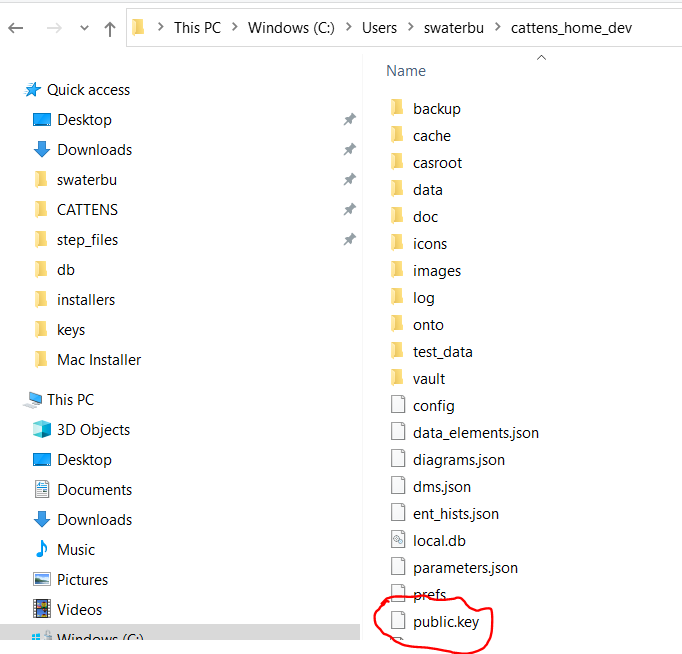

(After you email it to the admin, you no longer need the *public.key* file.)

The *private key* is a file called **pangalaxian.key** which is located in your
profile folder (a.k.a. your "home directory").  Take care not to delete it
because it is used by **Pangalaxian** and will be used by any future version of
**Pangalaxian** you install.  The same **pangalaxian.key** file is used by both
**Pangalaxian** and **Pangalaxiandev**.

## Login to the Repository Service

After you have emailed your *public.key* file to the Pangalaxian Admin, you can log
in.

When the *Repository Service* icon in the **Tool Bar** is clicked,
**Pangalaxian** will use the *pangalaxian.key* file to do a transparent
single-sign-on login to the Repository Service.  *Note that the Repository
Service icon is a toggle -- you use it to log in or to log out.*

When you log in to the Repository Service, **Pangalaxian** will:

1.  Get the names of **Projects** on which you have been assigned
    **Roles**.  (This may result in **Projects** being added or removed in the
    **Project Selector**.)
2.  Subscribe to events regarding those **Projects**, such as the addition of
    new  **Systems** and **Components** to a **Project**.
3.  Get any new (since your last login) "public" (non-proprietary) objects in
    the repository **Hardware Library** and save them to its local database.
4.  Sync the currently selected **Project**, fetching any "private" objects
    that have been added to the **Project** since your last login.
5.  Display your assigned **Role(s)** in the current **Project** in the
    **Status Bar** (the label next to the *network status indicator*).

Once the initial sync is completed, **Pangalaxian** will listen for events,
such as additions or modifications of objects, and will update in real-time.

Whenever you switch to a different project using the **Project Selector**, the
Project sync operation (step 4 above) is executed for the newly selected
**Project**.

# How To

## Switch Modes in Pangalaxian

The **Pangalaxian** GUI has 3 interface **modes** of operation:

* **[Component Modeler]**
* **[System Modeler]**
* **[Local DB]**

You can switch between these **modes** by clicking on one of the **Mode
Buttons** in the top right corner of the window, as shown in the figure below.
The currently selected **mode** is indicated by which button is in the
*clicked* state (toggled *on*).  The buttons are shown here with **[System
Modeler](#systems-modeler)** **mode** selected (that is the default mode).
When you exit **Pangalaxian**, it will remember the **mode** you are in and
will return you to that **mode** the next time it starts up.

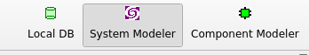

### System Modeler

**System Modeler** mode is mainly designed to provide convenience for viewing
the current state of an entire **System** assembly structure and its subsystem
and component parameters, which are shown in the **Systems Dashboard**.
Although it is possible to edit objects in **Systems Modeler** mode if your
assigned **Project Role(s)** give you edit permissions, in general it is easier
and more efficient to do such edits in the **Component Modeler** mode.

Note that the system assembly tree structure, block diagram, and **Systems
Dashboard** are automatically updated in real-time when any subsystem is added,
modified, or deleted by anyone who is connected to the repository.  Modified
parameters are updated in real-time and any rolled-up parameters are recomputed
and displayed in the **Systems Dashboard** in real-time.

The **System Modeler** mode interface looks like the figure below:

### Component Modeler

**Component Modeler** mode is intended to provide convenience for viewing
and editing **Systems**, **Components**, or library **Products**.  The
**Component Modeler** has 2 main purposes:

1.  To view the parameters and structure (components) of **any** item in the
**Systems & Components Library** (does not require edit privileges).

2.  To edit a **System** or **Subsystem** -- see details in **[Use Component
Modeler Mode to Edit a System or Subsystem]**, below.

### Local DB

**Local DB** mode provides a view into the local database.  The database table
names (**DB Tables**) are listed on the left side; clicking on a db table name
displays its **Objects** in the tablular widget on the right.

## Use the Object Viewer/Editor

The **Object Viewer/Editor** provides an interface to all parameters, data
elements, and other properties of an object.

### How To Access

The **Object Viewer/Editor** dialog can be displayed in the following ways:

* In **[Component Modeler]** mode, just **click and drag** any item from the
  **[Systems and Components (Hardware Products)
  Library](#systems-and-components-hardware-products-library)**, (right panel)
  and **drop** it onto any field in the **Product** panel (upper left) -- that
  will load the object into the **Object Viewer/Editor** on the left and
  display its block diagram;

* In **[System Modeler]** mode, **right-click** on any object in either the
  **Library Panel** (right side of the **[Main Window](#main-window-elements)**),
  the **System Tree** (lower left panel), or the block diagram (center) and
  select ***View this object*** in the context menu;

* In **[Local DB]** mode, **double-click** on any line in the **Objects**
  table (right side).

Note that the **Object Viewer/Editor** always has exactly the same interface and
functionality wherever it is invoked.

### Interface Elements

* **Parameter Tabs** display the object's parameters.  As many parameter tabs
  as necessary will be created to accomodate parameters as they are added --
  typically, at least 2 parameter tabs are needed, to accommodate the minimum
  default parameters for Mass, Power, Data Rate and their associated variants.

* **Freeze Button** freezes the object (prevents further editing)

* **Where-Used Button** displays the names of next-higher systems (assemblies)
  that contain this object as a component.

* **Project Usage Button** displays the names of all projects in which object
  is used as a system or component.

* **Clone Button** clones the object (creates a copy with the same properties)
  -- see **[Clone an Object]**.

* The other tabs are:
    - **data** tab(s) display the object's data elements.  As many data tabs
      as necessary will be created -- typically, only 1 data tab is
      needed, to accommodate the **TRL** and **Vendor** data elements.
    - **main** tab, which contains *id*, *name*, *description*, and other
      fields.
    - **info** tab (optional), which contains fields that "overflow" from
      the **main** tab.
    - **narrative** tab, which contains unlimited text fields.
    - **admin** tab, which contains administrative properties of the object
      such as the *oid* (unique object identifier), *creator*,
      *create_datetime*, *modifier*, and *mod_datetime* of the object.

### View Mode

The **Object Viewer/Editor** usually initializes in **View Mode** (the
exceptions being in the **[Cloning](#clone-an-object)** process and the
**[System/Component Wizard](#use-the-systemcomponent-wizard)**, in which the
process requires **Edit Mode**).  If you have edit permission for the object
being viewed, there will be an **Edit** button at the bottom of the **Object
Viewer/Editor** interface that will switch the interface to **Edit Mode**.

In **View Mode** (figure below) you can explore the object by selecting various
tabs in the interface.  If an attribute of the object is another object, that
attribute's value will appeaar as a button, which if clicked will display the
related object in another **Object Viewer/Editor**.

")

### Edit Parameters, Data Elements, and Other Properties

In **Edit Mode** any fields which are displayed as editable can be edited.
Note that some fields are intrinsically *read-only*, such as computed
parameters -- for example, the **CBE** (**"Current Best Estimate"**) parameters
are always computed as a recursive sum of an object's components' parameters,
so they are *read-only* and are so annotated.

### Add Parameters or Data Elements

If you need to assign more parameters or data elements to the object:

* Make sure you are in **edit mode**
* Select the **Parameters** or **Data Elements** library (use the **Library
  Selector** pull down to select the library in the **Libraries** panel)
* **Drag** the parameter or data element from the library and **drop** it onto
  either a **parms** panel (labeled *parms_0*, *parms_1*, etc.) or a **data**
  panel, respectively (the viewer/editor will automatically add more parms or
  data tabs if necessary).

### Delete Parameters or Data Elements

Again, this will only work in **edit mode**:  right-click on the label of the
parameter or data element you want to delete and select *delete*.

## Use Component Modeler to Edit a System or Subsystem

In **Component Modeler** mode, you can **click and drag** any item from the
**Systems & Components (Hardware Products) Library** and **drop** it onto the fields in the **Product** panel (see
figure below) and it will become the subject of the **Component Modeler**:  its
***id***, ***name***, and ***version*** will be displayed in the **Product**
panel, its *name* and *id* will become the title in the **Object Viewer/Editor
Panel** (left side) and its full set of **Parameter** values and other data
will be accessible there.  Its **Internal Block Diagram** (equivalent to a
*SysML* **IBD**) will be shown in the central **Block Diagram** panel. (If you
have edit permission for the product, the **Block Diagram** will be editable.)

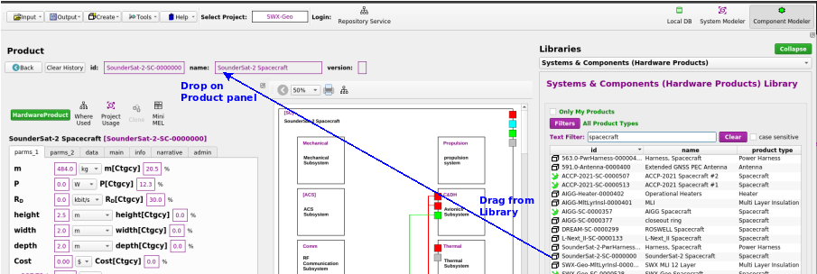

Once a product has been brought into the **Component Modeler**, it can be
viewed and (if you have edit permission for that product) edited in the
**Object Viewer/Editor** panel -- see
**[Use the Object Viewer/Editor](#use-the-object-viewereditor)**
for more detail.

### Add Components

To add a component, simply **drag** an item from the **Systems & Components
(Hardware Products)** library and **drop** it onto any open space within the
border of the diagram.  Note that you cannot drop an item onto another block in
the diagram *unless it is a **TBD** block, meaning that block is unoccupied (it
will have a dashed outline)*.

### Modify Components

If you want to modify an existing component block in a diagram (e.g. add
sub-components), simply **drill down** by double-clicking on the component
block -- the **drill down** operation will make that component the new subject
of the **Component Modeler**, and if you have edit privileges for that
component you will be able to edit it.  When you have finished editing the
component, you can go back to the previous object (the product that contains
the component) by clicking the "Back" button in the **Product** panel -- that
will change the subject of the **Component Modeler** back to the previous
object.

### Remove Components and Functions

To remove a component from an assembly, right-click on its block and select
either *Remove this component* or *Remove this function*.

* *Remove this component*: removes the product but leaves a **TBD** block that
  represents that "function" in the assembly -- the **TBD** block is unoccupied
  but can have requirements allocated to it, so whatever product is placed into
  that function should satisfy any allocated requirements.  Also, the **TBD**
  block will have an associated **Product Type** that corresponds to its
  function, and it will only accept products of that **Product Type**.  The
  **TBD** block can be removed using the *Remove this function* context menu
  item.

* *Remove this function*: removes the component block entirely, even if it is a
  **TBD** block.

## Create a New System or Component

Pangalaxian has 2 ways to do that:

1. **[Use the System/Component Wizard](#use-the-systemcomponent-wizard)** ...  
   In the **Create** menu, select the option
   **New System or Component (Product)**  
  ***-- or --***
2. **[Clone](#clone-an-object)** an existing system or component.

## Use the System/Component Wizard

The **System/Component Wizard** provides a guided process to create a new System or
Component (a.k.a. Product).

Note that any new system or component that is marked **public** will
automatically be added to the **[Systems and Components (Hardware Products) Library]** and will then be
usable in the assembly of any new system.  **Non-public** (sensitive or
proprietary) systems or components (i.e. those for which the **public** field
is not checked) will only be visible to users who have been assigned roles in
their **owner** project or organization.

")

")

")

")

## Clone an Object

**Cloning** in **Pangalaxian** simply means creating a copy of an object.  In
general, the clone will have the same property values, parameter values, and data values
as the original object.

A clone is created by clicking on the **Clone** button in the
**[Object Viewer/Editor](#use-the-object-viewereditor)**
-- if the object being cloned is a **white box** (its components are
specified), a dialog will be displayed with various options (see details
below); if the object is a **black box**, **Pangalaxian** will immediately create
the clone and switch to **[Component Modeler]** mode with the new clone set as
the subject, and you can begin editing it as necessary.  The clone will
automatically be assigned a new *id*, but you should edit its *name* and
*description* fields at least, and edit its component structure as necessary --
see **[Use Component Modeler Mode to Edit a System or Subsystem]** for more
information about how to do that.

### Options for Creating a Clone from a White Box Object

If the object being cloned is a **white box** -- i.e. it has a specified set of
components -- then clicking the **Clone Button** in the **Object
Viewer/Editor** will bring up a dialog with options, as shown here:

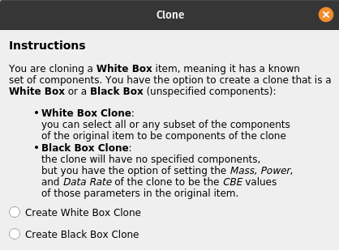

#### Create a White Box Clone

If you select the **Create White Box Clone** option, the following dialog will
be displayed:

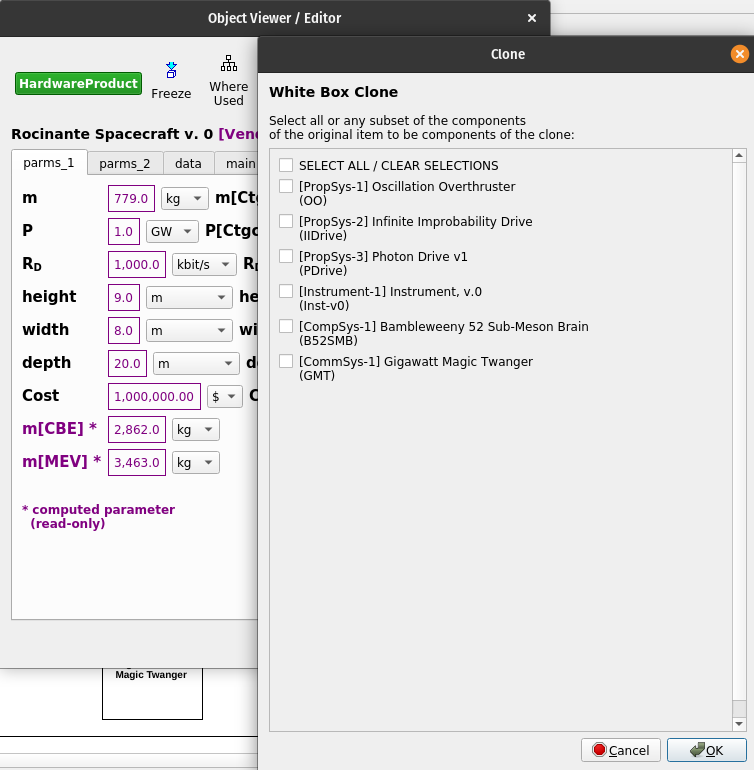

As the instructions say, you can select all components or any subset of them,
and the clone will then contain references to exactly the components that you
select.  Note that the clone's components will not be *copies* of the original
components, they will be *indentical* to the components selected -- in other words,
the components of the clone will be pointers to the library objects that you
selected from the original object's components.  If you want the new clone's
components to be different from those of the original object, it is better to
select **Create a Black Box Clone** and then populate the resulting **black
box** with any components you specify, making it into a **white box**.

#### Create a Black Box Clone

If you select the **Create Black Box Clone** option, the following dialog will
be displayed:

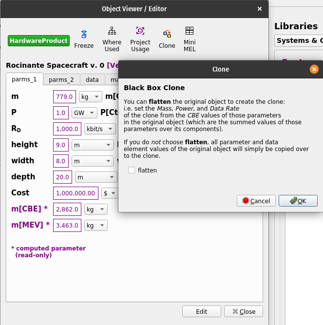

As the instructions say, you can select **flatten**, in which case the **CBE**
(**Current Best Estimate**) values of **Mass[CBE]**, **Power[CBE]**, and **Data
Rate[CBE]** for the original object are assigned to the **Mass**, **Power**,
and **Data Rate** parameters of the clone.  Since the **CBE** parameters of a
**white box** product are computed as the sum of the **CBE** parameters of its
components, this essentially **"flattens"** them into the new **black box**
object, which will have the same **CBE** parameters as the original object but
without its components.

If the **flatten** option is not selected, the clone will simply be assigned
the original object's specified **Mass**, **Power**, and **Data Rate**
parameters.

Note that in either case, whether a **white box** or **black box** clone is
created, the clone will receive *all parameters* of the original object.

## Define a Concept of Operations ("ConOps") and Power Modes

A **ConOps** defines the sequence of activities that constitute a **Mission**.
The **Lead Engineer** and **Systems Engineer** for a project can use the
**ConOps Modeler** to create a timeline on which the **Mission** **Activities**
are defined, and each **Activity** can be assigned a *duration* and can be
characterized by a *power mode*. The features of the **ConOps Modeler**
interface are shown here:

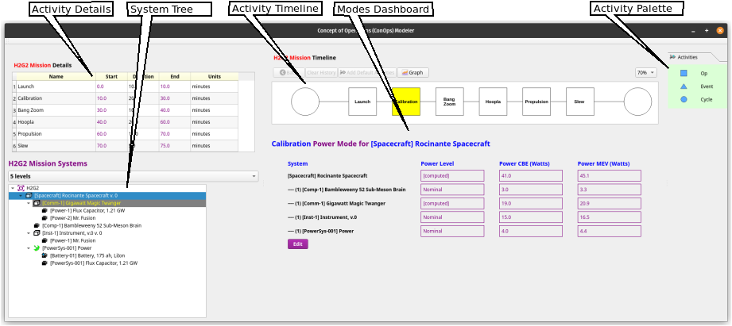

To begin, select the **ConOps Modeler** item in the **Tools** menu.

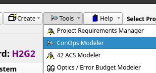

The first time the ConOps Modeler is opened for a new project, it will display
an empty **Mission Timeline** scene, a **Mission Details** table, and the
**Mission Systems** assembly tree, as shown here:

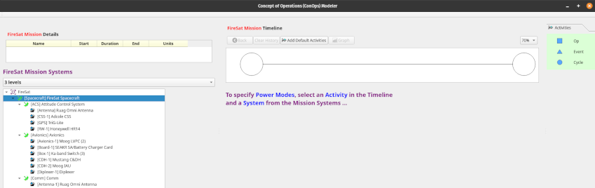

### Add Activities to a Timeline

The first step is to begin adding activities to the **Mission Timeline**. This
can be done by either of 2 methods:

1. Click the **Add Default Activities** button, which will add the
   following activities to the **Timeline**: **Launch**, **Calibration**,
   **Propulsion**, **Slew**, **Science Data Acquisition**, **Science Data
   Transmission**, **Safe Hold** -- note that **any** of these activities can
   easily be **renamed or deleted** if not applicable to your mission:

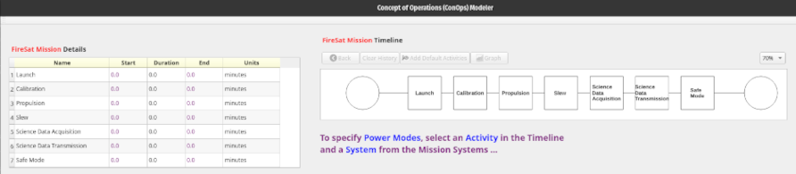

**-- OR --**

2. Drag an **Activity Type** (**Op**, **Event**, or **Cycle**) icon from the
   **Activities** palette on the right side and drop it onto the **Timeline**,
   which creates a new **Activity block** of that type in the **Timeline** and
   a new row in the **Details** table on the left:

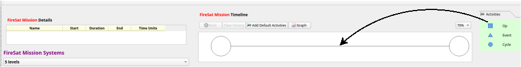

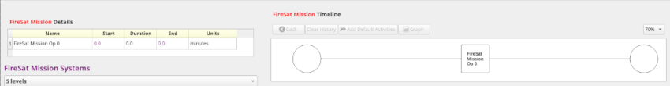

Once an activity has been added to the **Timeline**, its *Name*, *Duration*,
and *Time Units* can be edited in the **Details** table on the left side of the
interface simply by clicking on the cell, typing a value, and hitting *Return*.
Note that the *Start* and *End* times are computed from the *Duration* values,
so they cannot be edited.

### Define System Power Modes

After one or more **Activities** have been added to the **Timeline**, power
modes can be defined -- to do that:

1.  Select an **Activity** block by clicking on it -- it will be highlighted in
    yellow.

2.  Select a system by clicking on an item in the **System Tree** (left panel).
    Typically either an Observatory or a Spacecraft will be selected first, as
    the highest-level system for which power modes will be defined; in the case
    of a Spacecraft, its subsystems may each in turn be selected for more
    detailed power mode definitions. When a system is first selected, you will
    see the dialog shown here:

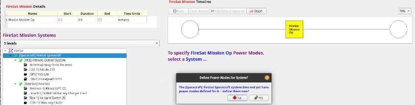

3.  When an **Activity** and a system have been selected, the **Modes
Dashboard** will be displayed, as shown here:

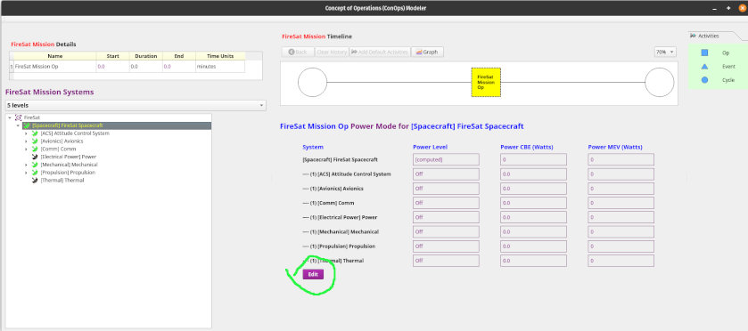

4.  To begin defining a mode, click on the **Edit** button (circled in green
in the diagram above) and the dashboard will show selectable pull-down lists
of named power levels for each component or subsystem of the system that has
been selected in the system tree:

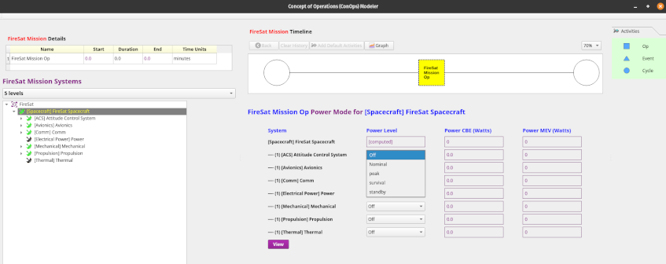

When a power level is specified, the **ConOps Modeler** looks up the component
or subsystem's specified value for that power level and immediately uses it to
populate the corresponding **Power CBE** and **Power MEV** columns for that
component or subsystem.

### Define Computed Subsystem Power Modes

The definition of power modes will typically begin at either the
**Observatory** or **Spacecraft** level, but a subsystem power mode can be
defined in terms of the power characteristics of its components -- this is done
by clicking on the corresponding subsystem in the **System Tree** in the left
panel, where the initial system was selected ... a dialog will be displayed
asking for confirmation that you wish to define power modes for that subsystem
-- as shown:

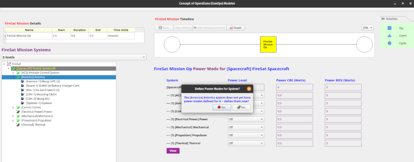

In the example shown above, the **Avionics** subsystem has been selected.  When
you have clicked **Yes** in the dialog, the dashboard will immediately display
the components of the selected subsystem and you can select the modal power
levels for each of the subsystem's components.  Note that the subsystem's mode
level will now be shown as *[computed]*, both in its own dashboard view and in
the mode dashboard of its parent system (in this case, the **Spacecraft**).

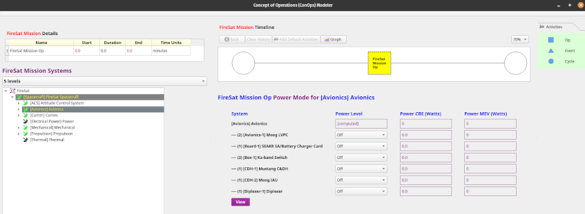

If you have mistakenly selected a subsystem or have later decided *not* to
define the subsystem's power modes in terms of the power levels of its
components, go to the **System Tree**, right-click on that subsystem, and
select *"Remove from computed item modes"* -- that will immediately remove the
subsystem's mode definition from the computed modes, so its power modes can be
specified directly by selecting power levels.

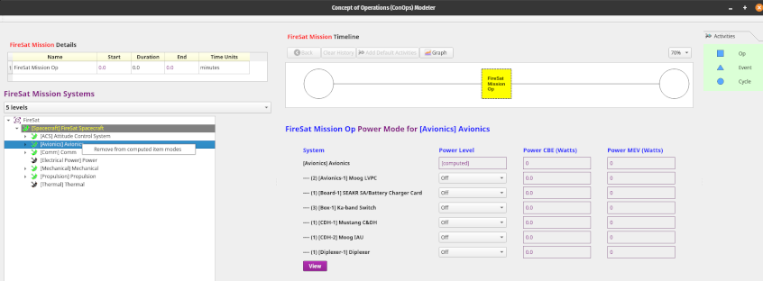

### Add Cyclic Activities

A **Cyclic Activity** can be added by dragging the "Cycle" icon from the
**Activity Palette** and dropping it onto the **Timeline**, as shown:

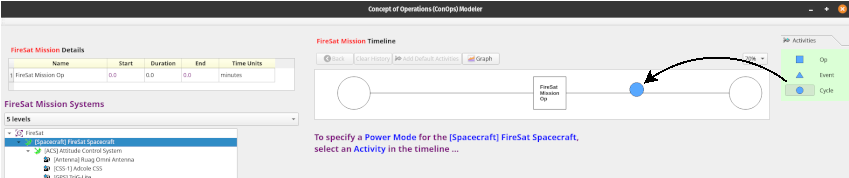

When the drop action has completed, the resulting **Cyclic Activity** will be
displayed:

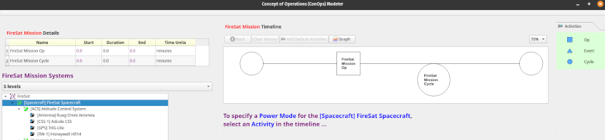

### Define Sub-Activities in a Cycle Timeline

A **Cyclic Activity** has its own associated **Timeline** that represents one
of its cycles.  The **Timeline** for the **Cyclic Activity** can be defined as
follows:

1.  Select the **Cyclic Activity** by clicking on it -- it will turn yellow.

2.  Double-click on the **Cyclic Activity** and an empty **Timeline** will be
    displayed:

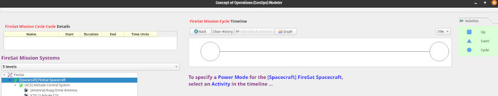

3.  Add **Activity** blocks by drag / dropping them, as in the system **Timeline**.

4.  Edit the names, durations, and time units of the **Activity** blocks as
    before, by clicking on a cell in the **Activity Details** table on the left
    and hit *Enter* or simply click on another cell when done.

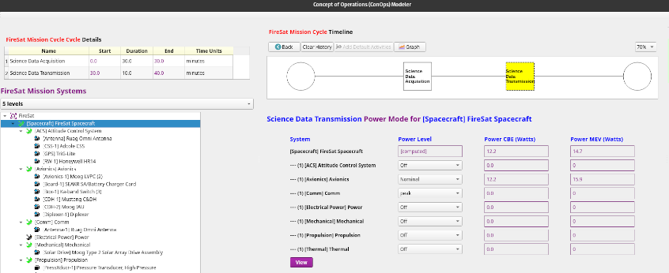

5.  When finished defining the **Sub-Activities** and associated **Power Modes**
    for each system and subsystem during the **Cycle**, return to
    the **System Timeline** by clicking the **Back** button above the
    **Timeline**:

### Graph System Power Modes vs. Time

To display a graph of the **System Power Modes vs. Time**, simply click on the
**Graph** button above the **Timeline**:

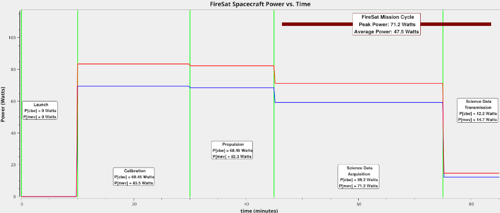

The graph can be saved as either a ".png" or ".pdf" file.

Note that when one of the activities in the **Timeline** is a **Cyclic
Activity**, only one cycle will be shown in the graph.  The graph will show the
**Peak Power** and **Average Power** values for the cycle.  The **ConOps Tool**
is also capable of defining cycles within cycles and graphing them, if a
mission **Timeline** contains them.

## Use Local DB Mode to Display Tables and Export to Files

Any row in the **Objects** table can be double-clicked to display that object
in the **[Object Viewer/Editor](#access-the-object-viewereditor)**.
The **Objects** table can be sorted on any column by clicking on that column's
heading.  Columns can be rearranged by drag/drop, and you can select which
columns you want displayed for a given object type by right-clicking on the
headers, which displays a context menu, and choosing the **select columns**
option, which will display all the attributes of the current object type and
you can just check the attributes you want to see and uncheck the ones to hide.
**Pangalaxian** will remember your choices and will use them the next time you
go into **Local DB** mode.

## Set Preferred Units

Preferred units can be set using either the *Edit Preferences* item in the
*Tools* menu or by right-clicking on the **Systems Dashboard** headers and
selecting *set preferred units*.  When you have set the preferred units for
a specified set of dimensions, **Pangalaxian** will use your preferred units when
displaying any parameter that has those dimensions in both the **[Systems
Dashboard](#system-modeler)** and the **[Object
Viewer/Editor](#use-the-object-viewereditor)**,
and your preference is saved and used in all future sessions.

