% Pangalaxian User Guide

# Quick Start

## Install Pangalaxian

* On Windows, run *pangalaxian_x.x_setup.exe* as you would any Windows app
  installer.
* On Mac, follow the instructions in the *PANGALAXIAN_MAC_README.txt* file,
  which you should find in the same location as the Mac "installer".

## Run Pangalaxian

The first time Pangalaxian starts up, it will create a directory called either
***pangalaxian_home*** (for the production version) or
***pangalaxian_home_dev*** (for the development version).  In that directory it
will create a local database and it will load some reference data, which will
take a minute or two.  Once the initial start up has loaded the reference data,
subsequent start ups of Pangalaxian will just take a few seconds.

## Generate a Public/Private Key Pair...

1. In the Pangalaxian *Output* menu:

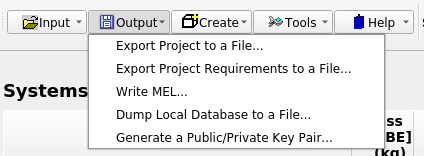

... select the menu item *Generate a Public/Private Key Pair*
This generates a pair of encrypted keys that are used in the single-sign-on
process that **Pangalaxian** uses to log in to its Repository Service.

2.  Email the *public.key* file to the **Pangalaxian** admin -- the
*public.key* file for the production version of **Pangalaxian** on Windows is
located here:  

**C:\\Users\\[your userid]\\pangalaxian_home\\public.key**

... and for the development version on Windows it is here:  

**C:\\Users\\[your userid]\\pangalaxian_home_dev\\public.key**

On the Mac, the locations are:

**/Users/[your userid]/pangalaxian_home/public.key**
and
**/Users/[your userid]/pangalaxian_home_dev/public.key**

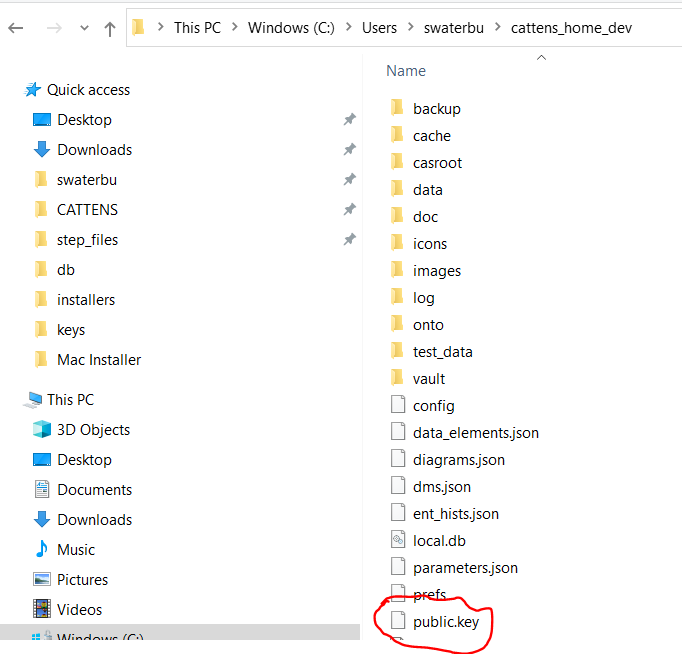

(After you email it to the admin, you no longer need the *public.key* file.)

The *private key* is a file called **pangalaxian.key** which is located in your
profile folder (a.k.a. your "home directory").  Take care not to delete it
because it is used by **Pangalaxian** and will be used by any future version of
**Pangalaxian** you install.  The same **pangalaxian.key** file is used by both
**Pangalaxian** and **Pangalaxiandev**.

## Login to the Repository Service

After you have emailed your *public.key* file to the Pangalaxian Admin, you can log
in.

When the *Repository Service* icon in the **Tool Bar** is clicked,
**Pangalaxian** will use the *pangalaxian.key* file to do a transparent
single-sign-on login to the Repository Service.  *Note that the Repository
Service icon is a toggle -- you use it to log in or to log out.*

When you log in to the Repository Service, **Pangalaxian** will:

1.  Get the names of **Projects** on which you have been assigned
    **Roles**.  (This may result in **Projects** being added or removed in the
    **Project Selector**.)
2.  Subscribe to events regarding those **Projects**, such as the addition of
    new  **Systems** and **Components** to a **Project**.
3.  Get any new (since your last login) "public" (non-proprietary) objects in
    the repository **Hardware Library** and save them to its local database.
4.  Sync the currently selected **Project**, fetching any "private" objects
    that have been added to the **Project** since your last login.
5.  Display your assigned **Role(s)** in the current **Project** in the
    **Status Bar** (the label next to the *network status indicator*).

Once the initial sync is completed, **Pangalaxian** will listen for events,
such as additions or modifications of objects, and will update in real-time.

Whenever you switch to a different project using the **Project Selector**, the
Project sync operation (step 4 above) is executed for the newly selected
**Project**.

# How To

## Switch Modes in Pangalaxian

The **Pangalaxian** GUI has 3 interface **modes** of operation:

* **[Component Modeler]**
* **[System Modeler]**
* **[Local DB]**

You can switch between these **modes** by clicking on one of the **Mode
Buttons** in the top right corner of the window, as shown in the figure below.
The currently selected **mode** is indicated by which button is in the
*clicked* state (toggled *on*).  The buttons are shown here with **[System
Modeler](#systems-modeler)** **mode** selected (that is the default mode).
When you exit **Pangalaxian**, it will remember the **mode** you are in and
will return you to that **mode** the next time it starts up.

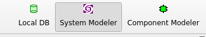

### System Modeler

**System Modeler** mode is mainly designed to provide convenience for viewing
the current state of an entire **System** assembly structure and its subsystem
and component parameters, which are shown in the **Systems Dashboard**.
Although it is possible to edit objects in **Systems Modeler** mode if your
assigned **Project Role(s)** give you edit permissions, in general it is easier
and more efficient to do such edits in the **Component Modeler** mode.

Note that the system assembly tree structure, block diagram, and **Systems
Dashboard** are automatically updated in real-time when any subsystem is added,
modified, or deleted by anyone who is connected to the repository.  Modified
parameters are updated in real-time and any rolled-up parameters are recomputed
and displayed in the **Systems Dashboard** in real-time.

The **System Modeler** mode interface looks like the figure below:

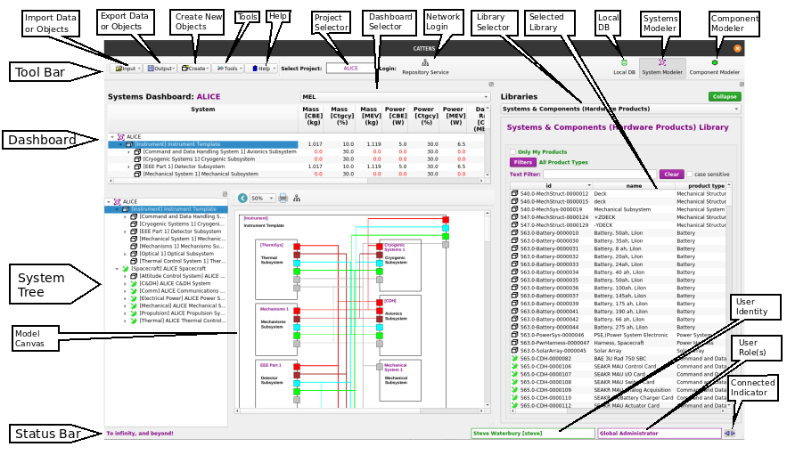

### Component Modeler

**Component Modeler** mode is intended to provide convenience for viewing
and editing **Systems**, **Components**, or library **Products**.  The
**Component Modeler** has 2 main purposes:

1.  To view the parameters and structure (components) of **any** item in the
**Systems & Components Library** (does not require edit privileges).

2.  To edit a **System** or **Subsystem** -- see details in **[Use Component
Modeler Mode to Edit a System or Subsystem]**, below.

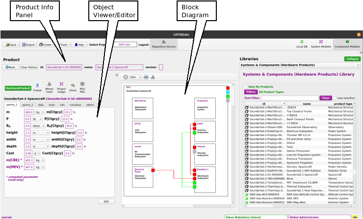

### Local DB

**Local DB** mode provides a view into the local database.  The database table
names (**DB Tables**) are listed on the left side; clicking on a db table name
displays its **Objects** in the tablular widget on the right.

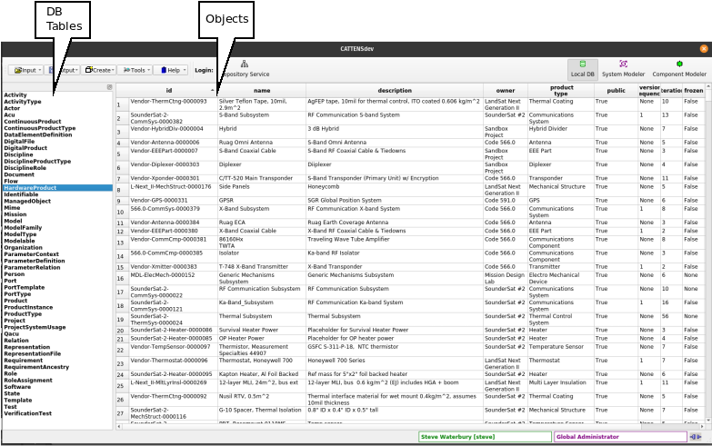

## Use the Object Viewer/Editor

The **Object Viewer/Editor** provides an interface to all parameters, data
elements, and other properties of an object.

### How To Access

The **Object Viewer/Editor** dialog can be displayed in the following ways:

* In **[Component Modeler]** mode, just **click and drag** any item from the
  **[Systems and Components (Hardware Products)
  Library](#systems-and-components-hardware-products-library)**, (right panel)
  and **drop** it onto any field in the **Product** panel (upper left) -- that
  will load the object into the **Object Viewer/Editor** on the left and
  display its block diagram;

* In **[System Modeler]** mode, **right-click** on any object in either the
  **Library Panel** (right side of the **[Main Window](#main-window-elements)**),
  the **System Tree** (lower left panel), or the block diagram (center) and
  select ***View this object*** in the context menu;

* In **[Local DB]** mode, **double-click** on any line in the **Objects**
  table (right side).

Note that the **Object Viewer/Editor** always has exactly the same interface and
functionality wherever it is invoked.

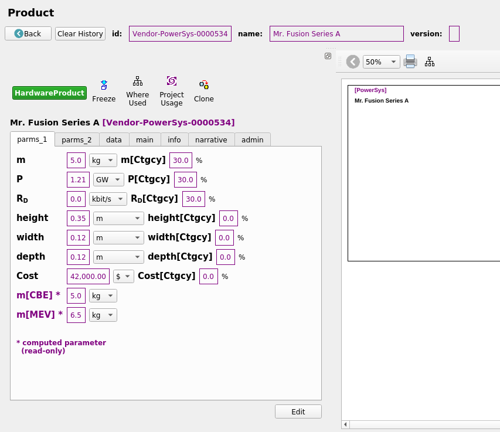

### Interface Elements

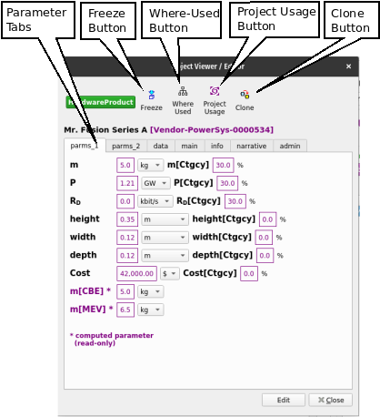

* **Parameter Tabs** display the object's parameters.  As many parameter tabs
  as necessary will be created to accomodate parameters as they are added --
  typically, at least 2 parameter tabs are needed, to accommodate the minimum
  default parameters for Mass, Power, Data Rate and their associated variants.

* **Freeze Button** freezes the object (prevents further editing)

* **Where-Used Button** displays the names of next-higher systems (assemblies)
  that contain this object as a component.

* **Project Usage Button** displays the names of all projects in which object
  is used as a system or component.

* **Clone Button** clones the object (creates a copy with the same properties)
  -- see **[Clone an Object]**.

* The other tabs are:
    - **data** tab(s) display the object's data elements.  As many data tabs
      as necessary will be created -- typically, only 1 data tab is
      needed, to accommodate the **TRL** and **Vendor** data elements.
    - **main** tab, which contains *id*, *name*, *description*, and other
      fields.
    - **info** tab (optional), which contains fields that "overflow" from
      the **main** tab.
    - **narrative** tab, which contains unlimited text fields.
    - **admin** tab, which contains administrative properties of the object
      such as the *oid* (unique object identifier), *creator*,
      *create_datetime*, *modifier*, and *mod_datetime* of the object.

### View Mode

The **Object Viewer/Editor** usually initializes in **View Mode** (the
exceptions being in the **[Cloning](#clone-an-object)** process and the
**[System/Component Wizard](#use-the-systemcomponent-wizard)**, in which the
process requires **Edit Mode**).  If you have edit permission for the object
being viewed, there will be an **Edit** button at the bottom of the **Object
Viewer/Editor** interface that will switch the interface to **Edit Mode**.

In **View Mode** (figure below) you can explore the object by selecting various
tabs in the interface.  If an attribute of the object is another object, that
attribute's value will appeaar as a button, which if clicked will display the
related object in another **Object Viewer/Editor**.

")

### Edit Parameters, Data Elements, and Other Properties

In **Edit Mode** any fields which are displayed as editable can be edited.
Note that some fields are intrinsically *read-only*, such as computed
parameters -- for example, the **CBE** (**"Current Best Estimate"**) parameters
are always computed as a recursive sum of an object's components' parameters,
so they are *read-only* and are so annotated.

### Add Parameters or Data Elements

If you need to assign more parameters or data elements to the object:

* Make sure you are in **edit mode**
* Select the **Parameters** or **Data Elements** library (use the **Library
  Selector** pull down to select the library in the **Libraries** panel)
* **Drag** the parameter or data element from the library and **drop** it onto
  either a **parms** panel (labeled *parms_0*, *parms_1*, etc.) or a **data**
  panel, respectively (the viewer/editor will automatically add more parms or
  data tabs if necessary).

### Delete Parameters or Data Elements

Again, this will only work in **edit mode**:  right-click on the label of the
parameter or data element you want to delete and select *delete*.

## Use Component Modeler to Edit a System or Subsystem

In **Component Modeler** mode, you can **click and drag** any item from the
**Systems & Components (Hardware Products) Library** and **drop** it onto the fields in the **Product** panel (see
figure below) and it will become the subject of the **Component Modeler**:  its
***id***, ***name***, and ***version*** will be displayed in the **Product**
panel, its *name* and *id* will become the title in the **Object Viewer/Editor
Panel** (left side) and its full set of **Parameter** values and other data
will be accessible there.  Its **Internal Block Diagram** (equivalent to a
*SysML* **IBD**) will be shown in the central **Block Diagram** panel. (If you
have edit permission for the product, the **Block Diagram** will be editable.)

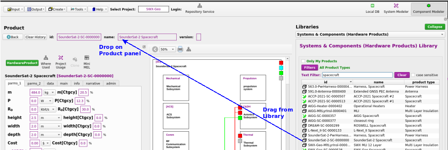

Once a product has been brought into the **Component Modeler**, it can be
viewed and (if you have edit permission for that product) edited in the
**Object Viewer/Editor** panel -- see
**[Use the Object Viewer/Editor](#use-the-object-viewereditor)**
for more detail.

### Add Components

To add a component, simply **drag** an item from the **Systems & Components
(Hardware Products)** library and **drop** it onto any open space within the
border of the diagram.  Note that you cannot drop an item onto another block in
the diagram *unless it is a **TBD** block, meaning that block is unoccupied (it
will have a dashed outline)*.

### Modify Components

If you want to modify an existing component block in a diagram (e.g. add
sub-components), simply **drill down** by double-clicking on the component
block -- the **drill down** operation will make that component the new subject
of the **Component Modeler**, and if you have edit privileges for that
component you will be able to edit it.  When you have finished editing the
component, you can go back to the previous object (the product that contains
the component) by clicking the "Back" button in the **Product** panel -- that
will change the subject of the **Component Modeler** back to the previous
object.

### Remove Components and Functions

To remove a component from an assembly, right-click on its block and select
either *Remove this component* or *Remove this function*.

* *Remove this component*: removes the product but leaves a **TBD** block that
  represents that "function" in the assembly -- the **TBD** block is unoccupied
  but can have requirements allocated to it, so whatever product is placed into
  that function should satisfy any allocated requirements.  Also, the **TBD**
  block will have an associated **Product Type** that corresponds to its
  function, and it will only accept products of that **Product Type**.  The
  **TBD** block can be removed using the *Remove this function* context menu
  item.

* *Remove this function*: removes the component block entirely, even if it is a
  **TBD** block.

## Create a New System or Component

Pangalaxian has 2 ways to do that:

1. **[Use the System/Component Wizard](#use-the-systemcomponent-wizard)** ...  
   In the **Create** menu, select the option
   **New System or Component (Product)**  
  ***-- or --***
2. **[Clone](#clone-an-object)** an existing system or component.

## Use the System/Component Wizard

The **System/Component Wizard** provides a guided process to create a new System or
Component (a.k.a. Product).

Note that any new system or component that is marked **public** will
automatically be added to the **[Systems and Components (Hardware Products) Library]** and will then be
usable in the assembly of any new system.  **Non-public** (sensitive or
proprietary) systems or components (i.e. those for which the **public** field
is not checked) will only be visible to users who have been assigned roles in
their **owner** project or organization.

")

")

")

")

## Clone an Object

**Cloning** in **Pangalaxian** simply means creating a copy of an object.  In
general, the clone will have the same property values, parameter values, and data values
as the original object.

A clone is created by clicking on the **Clone** button in the
**[Object Viewer/Editor](#use-the-object-viewereditor)**
-- if the object being cloned is a **white box** (its components are
specified), a dialog will be displayed with various options (see details
below); if the object is a **black box**, **Pangalaxian** will immediately create
the clone and switch to **[Component Modeler]** mode with the new clone set as
the subject, and you can begin editing it as necessary.  The clone will
automatically be assigned a new *id*, but you should edit its *name* and
*description* fields at least, and edit its component structure as necessary --
see **[Use Component Modeler Mode to Edit a System or Subsystem]** for more
information about how to do that.

### Options for Creating a Clone from a White Box Object

If the object being cloned is a **white box** -- i.e. it has a specified set of
components -- then clicking the **Clone Button** in the **Object
Viewer/Editor** will bring up a dialog with options, as shown here:

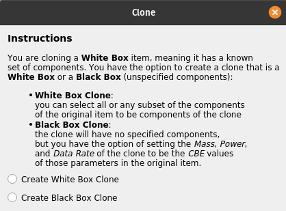

#### Create a White Box Clone

If you select the **Create White Box Clone** option, the following dialog will
be displayed:

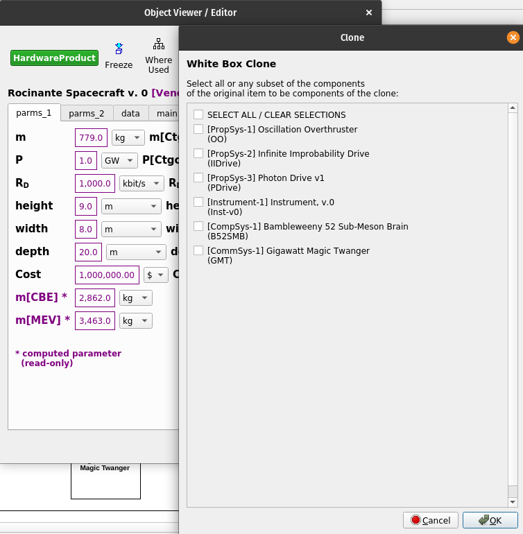

As the instructions say, you can select all components or any subset of them,
and the clone will then contain references to exactly the components that you
select.  Note that the clone's components will not be *copies* of the original
components, they will be *indentical* to the components selected -- in other words,
the components of the clone will be pointers to the library objects that you
selected from the original object's components.  If you want the new clone's
components to be different from those of the original object, it is better to
select **Create a Black Box Clone** and then populate the resulting **black
box** with any components you specify, making it into a **white box**.

#### Create a Black Box Clone

If you select the **Create Black Box Clone** option, the following dialog will
be displayed:

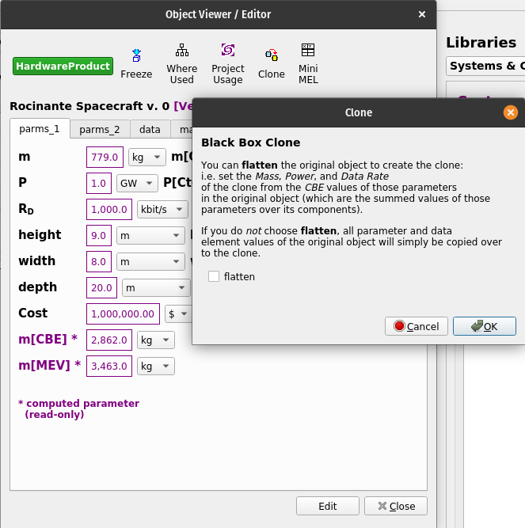

As the instructions say, you can select **flatten**, in which case the **CBE**
(**Current Best Estimate**) values of **Mass[CBE]**, **Power[CBE]**, and **Data
Rate[CBE]** for the original object are assigned to the **Mass**, **Power**,
and **Data Rate** parameters of the clone.  Since the **CBE** parameters of a
**white box** product are computed as the sum of the **CBE** parameters of its
components, this essentially **"flattens"** them into the new **black box**
object, which will have the same **CBE** parameters as the original object but
without its components.

If the **flatten** option is not selected, the clone will simply be assigned
the original object's specified **Mass**, **Power**, and **Data Rate**
parameters.

Note that in either case, whether a **white box** or **black box** clone is
created, the clone will receive *all parameters* of the original object.

## Import an Assembly from a STEP File

A **STEP** file (**ISO 10303**, usually with a *.stp* or *.step* extension) is
the standard interchange format that **CAD** systems export.  If a design
exists in **CAD**, **Pangalaxian** can read the assembly structure and the
component placements out of it, so that the structure does not have to be
built by hand and so that the position of each component within its assembly
is known.

Component placements matter beyond simply recording them:  the position and
orientation of each component within its assembly is what allows the mass
distribution of a system to be computed, which is the input an attitude
control simulation needs.

To begin, select the **Import STEP Assembly** item in the **Tools** menu.  It
is available in both **System Modeler** and **Component Modeler** modes.

<!-- SCREENSHOT: Tools menu with "Import STEP Assembly" highlighted -->

### Choose the File and What the Import Should Do

The first dialog asks for the file and for what should be done with it.

<!-- SCREENSHOT: the "Import a STEP Assembly" dialog, both options visible -->

Click **Select STEP file ...** to choose the file, then choose one of two
options.  They are quite different, and which one is right depends on whether
the assembly already exists in **Pangalaxian**:

* **Place the components of "..."** -- the assembly already exists here, and
  the file is the same design as it exists in **CAD**.  Each occurrence in the
  file is matched to a component the assembly already has, by **reference
  designator**, and the position of each is recorded.  *No products are
  created and no structure is changed* -- only placements are added.  This
  option is available only when an assembly is selected; if none is, it is
  disabled and says so.

* **Create products and assembly structure from the file** -- the design
  exists only in **CAD**.  A product is proposed for each distinct part in the
  file, and a usage for each occurrence of one, together with its placement.
  Use this to bring a design in for the first time.

### Review the Plan

Nothing is created until you have seen what would be created.  The second
dialog lists the import item by item:

<!-- SCREENSHOT: the plan dialog for a "create" import, showing several rows -->

Each row is one thing the import proposes to do, and each has a checkbox.  The
columns are:

* **kind** -- what the item is:  a **product** (a specification), a **usage**
  (a component in an assembly, at a particular reference designator), or a
  **placement** (where a component sits within its assembly).
* **status** -- what will happen to it:
    * **create** -- a new product will be created for it.
    * **use existing** -- a product already here will be used instead of
      creating another (see **Reuse** below).
    * **matched** -- the occurrence was matched to a component the assembly
      already has, and will be placed.
    * **no such component** -- the file has an occurrence at a reference
      designator this assembly does not have.  Nothing will happen to it.
    * **not in the file** -- the assembly has a component that the file does
      not, so there is nothing to place it by.  Nothing will happen to it.
* **in the assembly** -- the reference designator, or the path within the
  file.
* **product type** -- for a newly created product, what kind of thing it is.
  **STEP** carries no notion of a product type, so every new product starts as
  **unclassified**; you can set a type on any row from the list of known
  product types.  Leaving them **unclassified** is perfectly workable and can
  be corrected later.

  Setting them one row at a time gets tedious quickly on a real assembly, so
  the row below the table sets several at once:  choose a type there, then
  **Apply to all** to give it to every new product in the import, or
  **Apply to selected** to give it only to the rows you have selected.
  Select rows by clicking, and extend the selection with **Shift** or
  **Ctrl** as you would anywhere else.  Rows with no type to set -- usages,
  placements, and products that will be reused -- are simply skipped, so it
  does not matter if the selection takes some in.

  A sensible way to work through a large import is **Apply to all** with the
  commonest type first, then select the exceptions and apply the right type
  to those.
* **note** -- anything else worth knowing about the item.

The last two statuses are informational, and are worth reading:  they say what
the import will *not* cover, which usually matters as much as what it will.  A
run of **no such component** rows generally means the file is a different
design from the assembly, or that the reference designators do not agree.

Use **Accept all** and **Reject all** to set every checkbox at once, or click
individual checkboxes.  An unconfirmed product also drops the usages that
depend on it -- a usage cannot be created with one end missing -- so rejecting
a product rejects everything below it.

When creating products and structure with a project selected, the dialog also
offers to add the file's top-level assembly to the project as a system:

> **Add "..." to project ... as a system**

Leave this checked and the assembly will appear in the **System Tree**.
Unchecked, the assembly is still created, but is reachable only through the
**[Systems and Components (Hardware Products)
Library](#systems-and-components-hardware-products-library)**.

Click **OK** and the import runs.  Reading the file and creating the objects
each show progress:  a large assembly takes a noticeable amount of time, most
of it in reading the file.

### Reuse

A **Product** in **Pangalaxian** is a *specification*, not a piece of
hardware, and the owner of a specification controls it.  So the import will
only offer to reuse a product that you are entitled to reuse:  one that is
**public**, or one belonging to the project you are working in.  A
similarly-named specification belonging to another project is never proposed
for reuse; a new one is created instead.

Note also that a **STEP** file carries no provenance -- a part in it says
nothing about who specified it -- so matching is by name, and it is worth
checking the **use existing** rows before accepting them.

### The File Is Kept

When products and structure are created from a file, the file itself is
stored:  it is attached to the new assembly as an **MCAD Model**, and
uploaded to the repository so that others on the project can get it.

The correspondence between the file and the objects created from it is also
stored, so that a later import of the same file knows what it produced the
first time.  If you import a file that has changed since it was last
imported, **Pangalaxian** notices and asks before going on.

<!-- SCREENSHOT: the "file has changed" dialog -->

### Files That Come as a Set

A **CAD** system may export an assembly as a *set* of files rather than as
one:  the assembly file names its subassembly and part files, and refers to
them by name.  Such a file cannot be read on its own -- and the failure is a
quiet one, in that the assembly would appear to import successfully but with
its subassemblies empty.

**Pangalaxian** therefore checks first, and refuses the import if any
referenced file is missing, naming the files it could not find:

<!-- SCREENSHOT: the "Referenced files are missing" dialog -->

To proceed, get the missing files from wherever the assembly file came from,
and put them in the same directory as it, under exactly the names the message
gives.  Those are the names the file refers to them by, and a **STEP** reader
finds them no other way.

### Units

**STEP** files record their own units, and a file exported in inches is as
common as one exported in millimetres.  The units are read from the file and
all lengths are converted, so placements are recorded in metres regardless of
what the file used.

## Define a Concept of Operations ("ConOps") and Power Modes

A **ConOps** defines the sequence of activities that constitute a **Mission**.
The **Lead Engineer** and **Systems Engineer** for a project can use the
**ConOps Modeler** to create a timeline on which the **Mission** **Activities**
are defined, and each **Activity** can be assigned a *duration* and can be
characterized by a *power mode*. The features of the **ConOps Modeler**
interface are shown here:

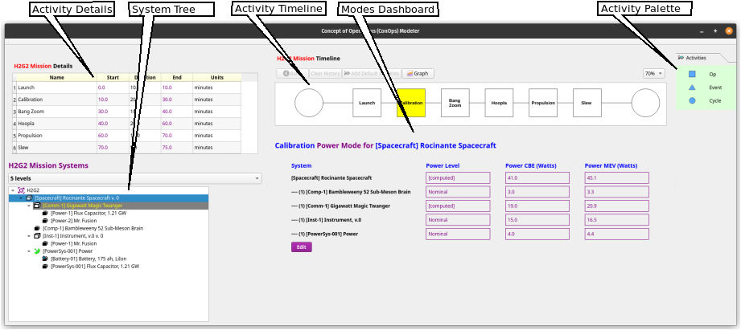

To begin, select the **ConOps Modeler** item in the **Tools** menu.

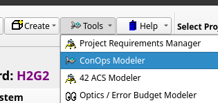

The first time the ConOps Modeler is opened for a new project, it will display
an empty **Mission Timeline** scene, a **Mission Details** table, and the
**Mission Systems** assembly tree, as shown here:

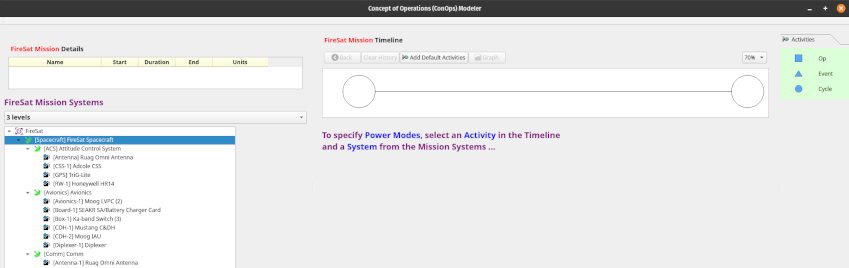

### Add Activities to a Timeline

The first step is to begin adding activities to the **Mission Timeline**. This
can be done by either of 2 methods:

1. Click the **Add Default Activities** button, which will add the
   following activities to the **Timeline**: **Launch**, **Calibration**,
   **Propulsion**, **Slew**, **Science Data Acquisition**, **Science Data
   Transmission**, **Safe Hold** -- note that **any** of these activities can
   easily be **renamed or deleted** if not applicable to your mission:

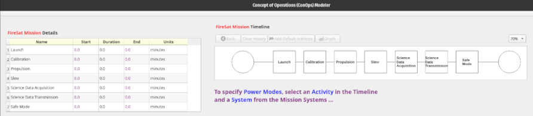

**-- OR --**

2. Drag an **Activity Type** (**Op**, **Event**, or **Cycle**) icon from the
   **Activities** palette on the right side and drop it onto the **Timeline**,
   which creates a new **Activity block** of that type in the **Timeline** and
   a new row in the **Details** table on the left:

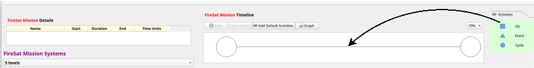

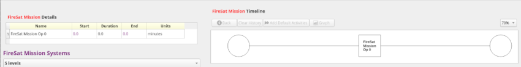

Once an activity has been added to the **Timeline**, its *Name*, *Duration*,
and *Time Units* can be edited in the **Details** table on the left side of the
interface simply by clicking on the cell, typing a value, and hitting *Return*.
Note that the *Start* and *End* times are computed from the *Duration* values,
so they cannot be edited.

### Define System Power Modes

After one or more **Activities** have been added to the **Timeline**, power
modes can be defined -- to do that:

1.  Select an **Activity** block by clicking on it -- it will be highlighted in
    yellow.

2.  Select a system by clicking on an item in the **System Tree** (left panel).
    Typically either an Observatory or a Spacecraft will be selected first, as
    the highest-level system for which power modes will be defined; in the case
    of a Spacecraft, its subsystems may each in turn be selected for more
    detailed power mode definitions. When a system is first selected, you will
    see the dialog shown here:

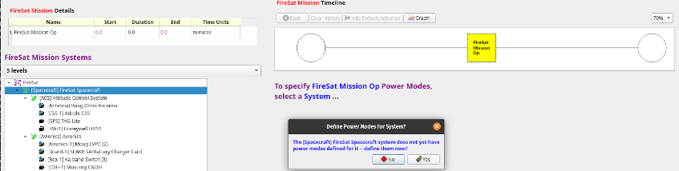

3.  When an **Activity** and a system have been selected, the **Modes
Dashboard** will be displayed, as shown here:

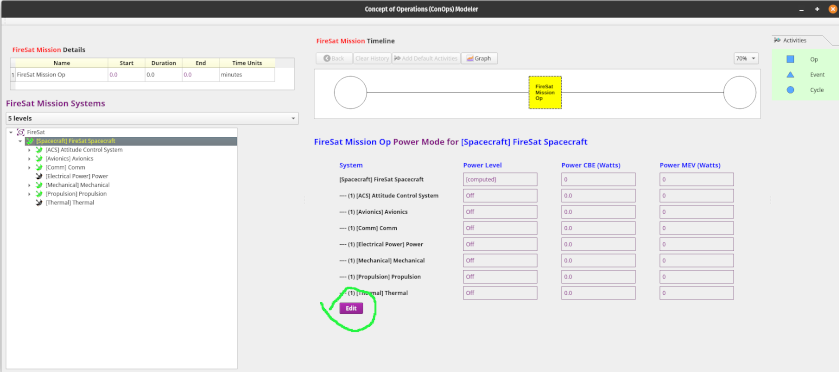

4.  To begin defining a mode, click on the **Edit** button (circled in green
in the diagram above) and the dashboard will show selectable pull-down lists
of named power levels for each component or subsystem of the system that has
been selected in the system tree:

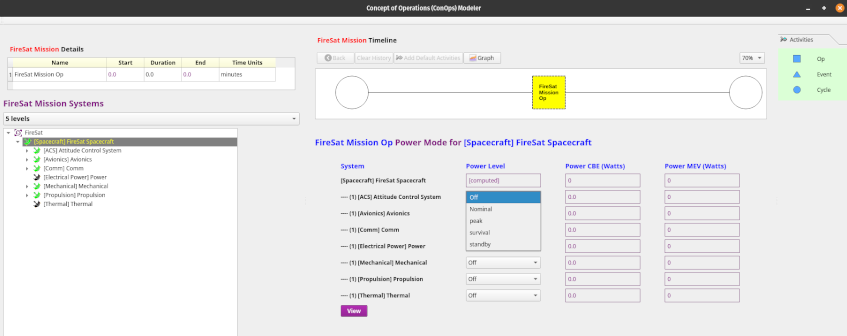

When a power level is specified, the **ConOps Modeler** looks up the component
or subsystem's specified value for that power level and immediately uses it to
populate the corresponding **Power CBE** and **Power MEV** columns for that
component or subsystem.

### Define Computed Subsystem Power Modes

The definition of power modes will typically begin at either the
**Observatory** or **Spacecraft** level, but a subsystem power mode can be
defined in terms of the power characteristics of its components -- this is done
by clicking on the corresponding subsystem in the **System Tree** in the left
panel, where the initial system was selected ... a dialog will be displayed
asking for confirmation that you wish to define power modes for that subsystem
-- as shown:

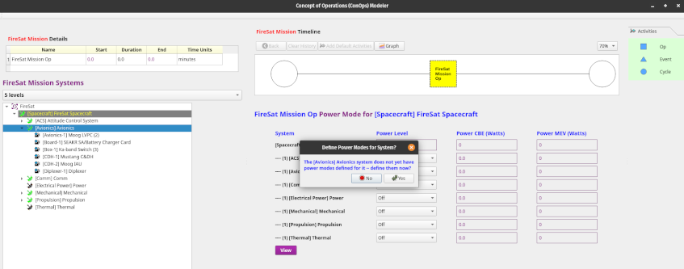

In the example shown above, the **Avionics** subsystem has been selected.  When
you have clicked **Yes** in the dialog, the dashboard will immediately display
the components of the selected subsystem and you can select the modal power
levels for each of the subsystem's components.  Note that the subsystem's mode
level will now be shown as *[computed]*, both in its own dashboard view and in
the mode dashboard of its parent system (in this case, the **Spacecraft**).

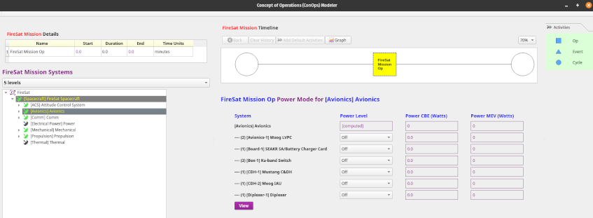

If you have mistakenly selected a subsystem or have later decided *not* to
define the subsystem's power modes in terms of the power levels of its
components, go to the **System Tree**, right-click on that subsystem, and
select *"Remove from computed item modes"* -- that will immediately remove the
subsystem's mode definition from the computed modes, so its power modes can be
specified directly by selecting power levels.

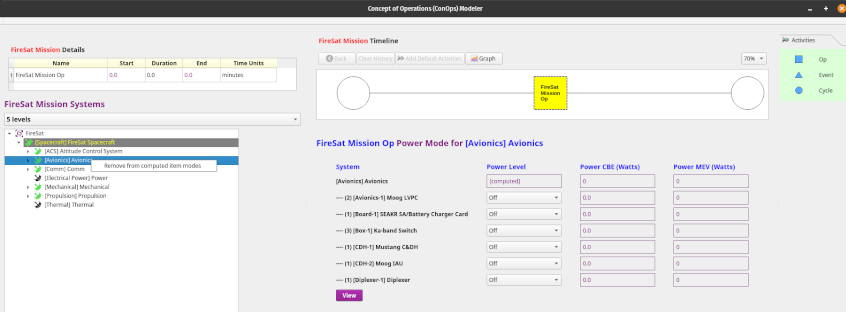

### Add Cyclic Activities

A **Cyclic Activity** can be added by dragging the "Cycle" icon from the
**Activity Palette** and dropping it onto the **Timeline**, as shown:

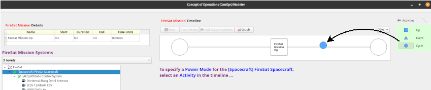

When the drop action has completed, the resulting **Cyclic Activity** will be
displayed:

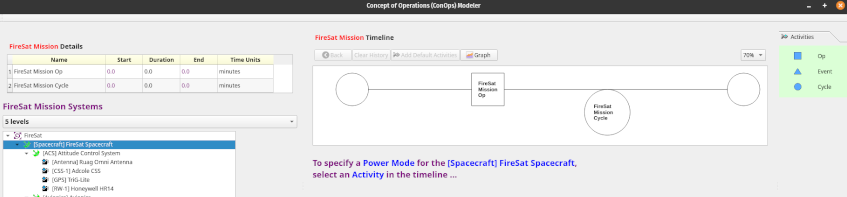

### Define Sub-Activities in a Cycle Timeline

A **Cyclic Activity** has its own associated **Timeline** that represents one
of its cycles.  The **Timeline** for the **Cyclic Activity** can be defined as
follows:

1.  Select the **Cyclic Activity** by clicking on it -- it will turn yellow.

2.  Double-click on the **Cyclic Activity** and an empty **Timeline** will be
    displayed:

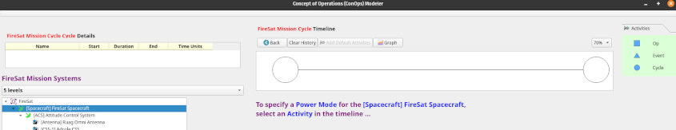

3.  Add **Activity** blocks by drag / dropping them, as in the system **Timeline**.

4.  Edit the names, durations, and time units of the **Activity** blocks as
    before, by clicking on a cell in the **Activity Details** table on the left
    and hit *Enter* or simply click on another cell when done.

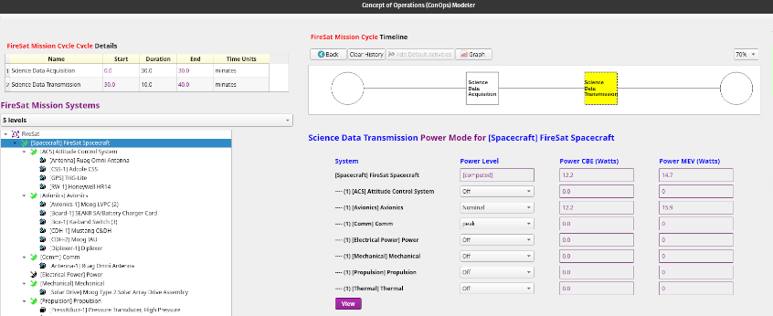

5.  When finished defining the **Sub-Activities** and associated **Power Modes**
    for each system and subsystem during the **Cycle**, return to
    the **System Timeline** by clicking the **Back** button above the
    **Timeline**:

### Graph System Power Modes vs. Time

To display a graph of the **System Power Modes vs. Time**, simply click on the
**Graph** button above the **Timeline**:

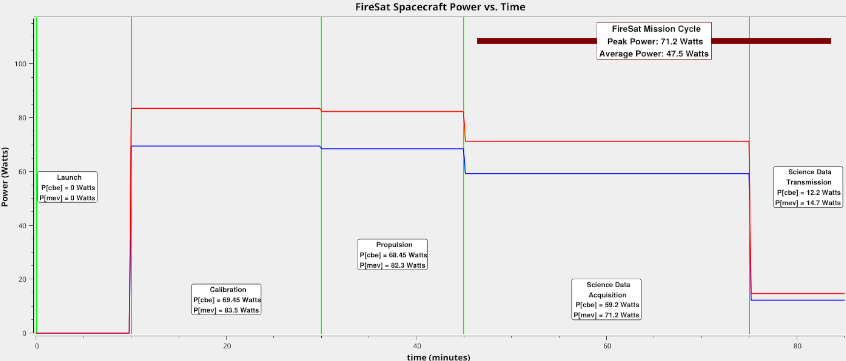

The graph can be saved as either a ".png" or ".pdf" file.

Note that when one of the activities in the **Timeline** is a **Cyclic
Activity**, only one cycle will be shown in the graph.  The graph will show the
**Peak Power** and **Average Power** values for the cycle.  The **ConOps Tool**
is also capable of defining cycles within cycles and graphing them, if a
mission **Timeline** contains them.

## Work While Disconnected from the Repository

**Pangalaxian** keeps a local database, so it runs perfectly well with no
connection to the repository.  What changes when you are disconnected is not
what you can *see* but what you may *edit*.

### What You May Edit Offline

While disconnected, you may edit:

* objects **you created on this machine** that the repository has not yet
  seen; and
* objects you have **checked out**.

Everything else is view-only until you reconnect.  This is deliberate.  The
repository decides which version of an object wins by its modification time,
and an edit you make offline carries the time you made it -- so if a
colleague changes the same object while you are away, your work is the older
version when you reconnect, and it is discarded.  Checking an object out
first means no one else can change it, so the situation cannot arise.

### Check Out the Items You Intend to Work On

Do this *before* you disconnect -- claims are granted by the repository, so
you must be connected to make them, and a project must be selected.  Select
the **Prepare for Offline Work ...** item in the **Tools** menu.

<!-- SCREENSHOT: Tools menu with "Prepare for Offline Work ..." highlighted -->

<!-- SCREENSHOT: the "Prepare for Offline Work" dialog -->

The dialog asks for two things and then lists what you can claim:

* **Purpose** -- free text, shown to your collaborators.  It is worth
  filling in:  it is what someone else sees when they find an item claimed,
  and it is the difference between "checked out by you" and "checked out by
  you *for the thermal rework*".
* **Claim expires after** -- between 1 and 90 days, 7 by default.  This is a
  backstop for a claim you forget to release; see **Check Items Back In When
  You Are Done** below.

**Available to check out** lists the items you may claim, each with a
checkbox, all checked initially; use **Select All** and **Select None** to
set them together.  **Not available** lists the ones you cannot, each with
the reason:  *already checked out by you*, *checked out by "someone"*,
*frozen*, or *no permission to modify*.

Some kinds of object are not offered at all, because they have no
independent existence:  **Ports**, **Flows**, **Representation Files**, and
the objects that reify relationships.  These are always created and edited as
part of work on the thing that owns them, so claiming the owner covers them
-- checking out a **Product** covers its ports.  **Projects** and the
**Person** and **Role** objects are not work items and are not offered
either.

The objects a **timeline** is made of are not offered either, for a
different reason:  they cannot be edited offline at all.  See **Activities
and Timelines** below.

Click **OK** and the claims are made.  The repository decides
authoritatively, applying the same permission rules, so occasionally an item
the dialog offered comes back refused.

### A Claim Is Exclusive

While an object is checked out, **only the holder may modify it** -- online
or offline, and including a **Global Administrator**.  This is the same
principle as a **frozen** object, where even an administrator gets no
**Edit** button:  the point of the claim is that the holder can rely on it.

An administrator who genuinely needs a claimed object can force-release it,
just as they would thaw a frozen object first.

An object that is checked out shows a **Checked Out** indicator in the
**[Object Viewer/Editor](#use-the-object-viewereditor)**, reading **Checked
Out (you)** if the claim is yours.  Hovering over it names the holder, when
the claim expires, and the purpose that was given for it.

<!-- SCREENSHOT: the Object Viewer/Editor showing the Checked Out indicator -->

### Check Items Back In When You Are Done

A claim is not meant to outlive the work it was made for.  When you have
finished with an item and are connected again, check it in, so that your
colleagues can edit it.

There are two ways to do it, and both need a connection -- the repository is
what records the release:

* **The Check In button** in the **[Object Viewer/Editor](#use-the-object-viewereditor)**,
  beside the **Checked Out (you)** indicator.  It appears only on items you
  hold and only while you are connected.

* **When you save.**  If you save an item you have checked out,
  **Pangalaxian** asks whether to check it in as well.  Saving and checking
  in are different things -- a save records your edit, a check-in gives up
  the claim -- but it is an easy assumption that saving does both, so you are
  asked rather than left to remember.  If you would rather not be asked, the
  question has a **Do not ask again** box.

<!-- SCREENSHOT: the Object Viewer/Editor showing Checked Out (you) and Check In -->

The indicator and the **Check In** button appear on any item that can be
checked out -- **Hardware Products**, but also the component usages
(**Acus**), **Models** and **Documents** that a claim on a product extends
to, so a claim made on your behalf is visible and releasable wherever you
meet it.

### Activities and Timelines

**Activities** cannot be edited while disconnected, and cannot be checked
out.  Neither can the **Decisions** and **Merges** that branch and rejoin a
sequence of them.

This is not an oversight.  An **Activity** is not an independent thing:  its
*duration* and its start and stop times are bound up with those of every
other **Activity** in its timeline, and the **ConOps Modeler** adjusts the
others as you change one.  So a claim on a single activity would not cover
the work -- the whole timeline would have to be claimed, which is a
different and larger idea than checking out an object.  The same goes for
the objects that sequence the activities.

Rather than support that badly, **Pangalaxian** keeps timeline work online:
the **Mission Details** table is read-only while you are disconnected, and
the **ConOps Modeler** will not accept a dropped activity.  Reconnect, and
both work as usual.

This may be revisited if offline timeline work turns out to be needed.

### Claims Expire

A claim also lapses by itself when its expiry passes, and the item becomes
editable by others again.  Expiry is the backstop rather than the intended
way to end a claim:  choose it long enough to cover the work, check the item
in when you are done, and if a claim is forgotten it will not block a
colleague indefinitely.  An administrator can also force-release a claim.

### When You Reconnect

Reconnecting syncs the current project:  your offline edits are sent to the
repository and anything that changed while you were away is fetched.
Reconnecting does not release your claims -- check them in, or let them
expire.

## Use Local DB Mode to Display Tables and Export to Files

Any row in the **Objects** table can be double-clicked to display that object
in the **[Object Viewer/Editor](#access-the-object-viewereditor)**.
The **Objects** table can be sorted on any column by clicking on that column's
heading.  Columns can be rearranged by drag/drop, and you can select which
columns you want displayed for a given object type by right-clicking on the
headers, which displays a context menu, and choosing the **select columns**
option, which will display all the attributes of the current object type and
you can just check the attributes you want to see and uncheck the ones to hide.
**Pangalaxian** will remember your choices and will use them the next time you
go into **Local DB** mode.

## Set Preferred Units

Preferred units can be set using either the *Edit Preferences* item in the
*Tools* menu or by right-clicking on the **Systems Dashboard** headers and
selecting *set preferred units*.  When you have set the preferred units for
a specified set of dimensions, **Pangalaxian** will use your preferred units when
displaying any parameter that has those dimensions in both the **[Systems
Dashboard](#system-modeler)** and the **[Object
Viewer/Editor](#use-the-object-viewereditor)**,
and your preference is saved and used in all future sessions.

